# Loyal MCQs — Exercise Reference Manual

**A reverse-engineered reference for the exercise system as it exists today.**

This document describes what is in the repository right now — it is not a proposal
and nothing in the original project was changed to produce it. Its purpose is to let
you rebuild Loyal MCQs (with a database, an admin UI, whatever you choose) without
having to reopen the live site and inspect every exercise by hand.

Everything here was derived by parsing all 168 HTML files, evaluating each exercise's
JavaScript question bank in a sandbox, and rendering representative exercises in a
real browser. Counts are actual counts, not estimates.

**Companion files**

| File | What it is |
|---|---|
| `exercise-inventory.json` | Machine-readable entry for all 152 exercises — engine, variant, data keys, answer model, assets, notes. Use this to drive a migration script. |
| `docs/exercise-reference/*.png` | 26 browser screenshots of every exercise type/variant and its states. |
| `ADDING_EXERCISES_PROMPT.md` | The reusable prompt to hand an AI when you add new exercises, so they get catalogued in the same shape. |

**Existing docs (written for the current site, still accurate and worth reading):**
`README.md`, `docs/architecture.md`, `docs/quiz-engine.md`, `docs/ui-and-styling.md`,
`docs/question-banks.md`, `docs/extending.md`.
This manual goes a layer deeper: per-exercise structure, variants, and visual detail.

---

## Table of contents

1. [Overview](#1-overview)
2. [Complete exercise inventory](#2-complete-exercise-inventory)
3. [Exercise taxonomy](#3-exercise-taxonomy)
4. [MCQ (139 files)](#4-mcq--139-files)
5. [Tap-to-select (6 files)](#5-tap-to-select--6-files)
6. [Drag & drop (4 files)](#6-drag--drop--4-files)
7. [Audio / listen-and-choose (3 files)](#7-audio--listen-and-choose--3-files)
8. [Outliers and special cases](#8-outliers-and-special-cases)
9. [Inconsistencies in the existing project](#9-inconsistencies-in-the-existing-project)
10. [Shared components and shared styling](#10-shared-components-and-shared-styling)
11. [Exercise-to-template mapping](#11-exercise-to-template-mapping)
12. [Full inventory table](#12-full-inventory-table)
13. [Recommended data model for the rebuild](#13-recommended-data-model-for-the-rebuild)

---

## 1. Overview

### 1.1 The shape of the system

There is no database and no build step. **Every exercise is one self-contained HTML
file** that:

1. links 1–2 shared stylesheets,
2. declares its entire question bank as a global `const questions = [...]` inside an
   inline `<script>`,
3. loads one shared engine `.js` file, and
4. calls that engine's `init…Quiz(questions)` function (except audio, which auto-runs).

All the *rendering* lives in the shared engine + CSS. The HTML file contributes only
a thin DOM skeleton and the data. That is the single most important fact for your
rebuild: **the per-file HTML is nearly identical across 152 files; what actually varies
is the data shape.**

```
exercise.html
 ├── <link> css/question.css            ← shell + tokens (always, except audio pages)
 ├── <link> css/tap_select.css | dnd.css  ← optional engine layer
 ├── <div id="site-header-placeholder">  ← replaced by js/partials.js
 ├── <main class="quiz-container">       ← the white card
 │    ├── <div class="question-section">
 │    │    ├── (img.question-image)      ← CREATED BY JS, not in the file
 │    │    ├── <h3 id="question-text">
 │    │    └── <ul class="options" id="options-list">   ← MCQ only
 │    ├── <div id="tap-grid">            ← tap-select only
 │    ├── <div class="two-targets">…<div id="choices">  ← drag & drop only
 │    ├── <div id="feedback" class="hidden">
 │    ├── <div id="explanation" class="hidden">
 │    ├── <button id="back-btn" class="hidden">   ← removed from DOM by every engine
 │    └── <button id="next-btn" class="hidden">
 ├── <script> const questions = [ … ] </script>
 ├── <div id="site-footer-placeholder">
 └── <script src="js/partials.js">
```

The progress bar (`#quiz-progress`) is **also created by JavaScript** and does not
appear in any exercise file.

### 1.2 Headline numbers

| Metric | Value |
|---|---|
| HTML files in repo | 168 |
| Exercise (question) files | **152** |
| Navigation / content / partial pages | 16 |
| Total authored questions across all banks | **14,583** |
| Engines | 4 (`script.js`, `tap_select.js`, `drag_and_drop.js`, `audio.js`) |
| Stylesheets | 5 (`question.css`, `index.css`, `tap_select.css`, `dnd.css`, `audio_style.css`) |
| Distinct HTML shells | 13 (only ~6 are meaningfully different; see §9) |
| Image files | 1,099 (708 png, 361 jpg, 30 jpeg) |

**By engine**

| Engine | Files | Init function | Source |
|---|---|---|---|
| MCQ | **139** | `initMCQQuiz(questions)` | `js/script.js:26` |
| Tap-to-select | **6** | `initTapSelectQuiz(questions)` | `js/tap_select.js:130` |
| Drag & drop | **4** | `initTwoBoxSortQuiz` / `initDragDropQuiz` | `js/drag_and_drop.js:310` / `:185` |
| Audio | **3** | *(none — auto-runs on load)* | `js/audio.js:131` |

**By subject**

| Level | Subject | Engine | Files |
|---|---|---|---|
| KG-3 | Math | tap-select | 6 |
| Level 1 | Math | MCQ | 47 |
| Level 1 | English | MCQ | 47 |
| Level 1 | English | drag & drop | 4 |
| Level 1 | English | audio | 3 |
| Level 1 | General Knowledge | MCQ | 25 |
| Level 1 | Science | MCQ | 20 |

### 1.3 Session behaviour (applies to every engine except drag & drop)

* The bank is the source of truth and is **never mutated**. A Fisher–Yates shuffle
  runs on a *copy*, and the first **25** entries are the session
  (`QUIZ_SIZE = 25` in `script.js:7`, `tap_select.js:60`, `audio.js:97`).
* Because banks hold ~100 questions, opening the same exercise twice gives a
  different 25 in a different order.
* **Options are never shuffled.** `loadQuestion()` renders `q.options` in array order,
  so the position of the correct answer is baked into the data. In generated banks
  the generator shuffled options at authoring time; in hand-written banks it is
  frequently in a fixed position (e.g. `level_1_eng_who_how_all.html` always lists
  `["how","who"]`).
* Flow is **forward-only**: every engine calls `backBtn.remove()` at startup, and
  `question.css:414` also carries `#back-btn { display: none !important; }`.
* One attempt per question: after answering, options are disabled. There are **no
  retries** and no way to change an answer.
* `Next` is disabled (`.is-locked`) while the emoji-rain celebration plays
  (~1.0–1.7 s + up to 0.25 s stagger + 60 ms), then unlocks via callback.
* At the end, the question area is replaced by a `.completion-message` card showing
  `Your Score: N / 25` and a `Home` button.
* Question text is passed through `stripLeadingNumber()`, which removes a leading
  `"1. "`, `"12) "` or `"3: "` but deliberately leaves math like `"3 - 1"` alone.

**Drag & drop is the exception:** it does *not* shuffle, does *not* draw 25 of 100,
and does *not* create a progress bar. It walks the whole bank in file order.

---

## 2. Complete exercise inventory

Counts below are actual file counts. The per-file table is in [§12](#12-full-inventory-table);
the same data machine-readable is in `exercise-inventory.json`.

### 2.1 By category and variant

| Category | Variant | Files | Questions |
|---|---|---:|---:|
| MCQ | Plain text question + text options | **82** | 8,182 |
| MCQ | Rich-text question (inline HTML) + text options | **32** | 3,198 |
| MCQ | Image per question + text options | **14** | 1,193 |
| MCQ | Image + story passage + text options | **6** | 542 |
| MCQ | One shared diagram + text options | **4** | 400 |
| MCQ | Emoji-group options (quantity comparison) | **1** | 100 |
| Tap-select | Size comparison (bigger/smaller emoji) | **1** | 100 |
| Tap-select | Quantity comparison (more/fewer) | **1** | 100 |
| Tap-select | Spatial / position (row & column layouts) | **1** | 100 |
| Tap-select | Grid match (tap the item(s) that fit a rule) | **1** | 100 |
| Tap-select | Count-N (tap exactly N things) | **1** | 100 |
| Tap-select | Scene count (emoji scene in question, numeral tiles) | **1** | 100 |
| Drag & drop | Sort into 2 labelled boxes | **2** | 40 |
| Drag & drop | Order into 4 boxes (sentence building) | **1** | 25 |
| Drag & drop | Demo page wiring both engines | **1** | 3 |
| Audio | Listen & choose (TTS, 2 buttons) | **3** | 300 |
| | **Total** | **152** | **14,583** |

### 2.2 MCQ option counts

Options per question, counted across every MCQ question in the repo:

| Options | Questions | Notes |
|---|---:|---|
| 2 | 6,471 | The most common shape; near-universal in Math |
| 3 | 6,938 | The most common shape in Science / GK / English vocabulary |
| 4 | 206 | Only 2 files use 4 consistently; 4 more mix 3 and 4 |

By *file* (dominant option count): **67 files are 2-option, 70 files are 3-option,
2 files are 4-option**, and 6 files mix counts within one bank.

> The MCQ engine labels options `A. B. C. D.` from a hard-coded array
> (`script.js:42`). A 5th option would render with an **empty** label. No bank
> currently exceeds 4, so this is latent, not a live bug.

### 2.3 Bank sizes

114 of 152 files hold exactly 100 questions. The other 38 do not — see
[§9.6](#96-bank-sizes-are-not-actually-uniform) for the full list. Ranges from 3
(the DnD demo page) to 119 (`level_1_eng_verbs_in_sentences.html`).

---

## 3. Exercise taxonomy

Two exercises belong to the same **variant** when they need the same rendering
logic. They belong to different variants when a rebuild would have to lay them out
differently, store different fields, or check answers differently. Different
question *wording* alone is never a variant.

The taxonomy has two axes, and I recommend you keep both in the rebuild:

**Axis 1 — Engine** (how interaction works): `mcq`, `tap-select`, `drag-drop`, `audio`.

**Axis 2 — Render variant** (how it looks / what fields it needs):

```
mcq.plain-text                 question is plain text, options are plain text
mcq.rich-text-question         question contains inline HTML (2nd line, colour, underline, <strong>)
mcq.image-per-question         q.image differs per question
mcq.image-shared-diagram       q.image is the SAME file on every question
mcq.image-story-passage        q.image + a centered HTML story block + a red prompt line
mcq.emoji-quantity-options     options are emoji runs of different lengths

tap.size-compare               same emoji at different font-sizes, fixed row
tap.quantity-compare           two emoji groups, fixed row
tap.spatial                    row/column layout for position words (+ optional scene image)
tap.grid-match                 responsive tile grid, 1 or many correct
tap.count-n                    tap exactly N identical tiles
tap.scene-count                emoji scene inside the question, numeral tiles as answers

dnd.sort-two-box               2 labelled boxes, 2 chips
dnd.order-four-box             4 ordered boxes, 4 chips
dnd.mixed-demo                 developer sample page

audio.listen-and-choose        TTS play button + 2 text buttons
```

Orthogonal to those, the inventory records **traits** — flags that don't change the
layout but do change the data or the authoring rules:

| Trait | Files | Meaning |
|---|---:|---|
| `html-in-question` | 43 | The `question` string contains markup and is injected with `innerHTML` |
| `bank-size-not-100` | 38 | Bank does not hold exactly 100 |
| `fill-in-the-blank` | 10 | Question uses `___` as a gap; options fill it |
| `mixed-option-count` | 6 | 2, 3 and/or 4 options within the same bank |
| `some-questions-missing-explanation` | 4 | No `explanation` field |
| `missing-image-files` | 4 | References image files that are not in the repo |
| `mixed-item-count` | 4 | Tile count varies within one tap-select bank |
| `layout-row` / `layout-column` | 3 / 1 | Tap-select `layout` key present |
| `multi-correct-questions` | 1 | More than one `correct: true` tile |
| `stray-initMCQQuiz-call` | 2 | Leftover call to an engine the page doesn't load |
| `leading-numbering-stripped-at-runtime` | 1 | Questions still carry `"1. "` prefixes |

---

## 4. MCQ — 139 files

**Engine:** `js/script.js` → `window.initMCQQuiz(allQuestions)` (line 26).
**Stylesheet:** `css/question.css` only.

### 4.1 Shared MCQ structure

Every MCQ file uses this skeleton (whitespace varies; see §9.1):

```html
<link rel="stylesheet" href="../../css/question.css" />
…
<div id="site-header-placeholder"></div>

<main class="quiz-container">
  <div class="question-section">
    <h3 id="question-text">Loading...</h3>
    <ul class="options" id="options-list"><!-- built by JS --></ul>
  </div>
  <div id="feedback" class="hidden"></div>
  <div id="explanation" class="hidden"></div>
  <button id="back-btn" class="hidden" onclick="loadPreviousQuestion()">Back</button>
  <button id="next-btn" class="hidden" onclick="loadNextQuestion()">Next</button>
</main>

<script>
  const questions = [ { question, options, correct, explanation, image? }, … ];
</script>

<div id="site-footer-placeholder"></div>
<script src="../../js/partials.js"></script>
<script src="../../js/script.js"></script>
<script>
  window.addEventListener("DOMContentLoaded", () => { initMCQQuiz(questions); });
</script>
```

**Data shape** — the only four keys that matter, plus one optional:

```js
{
  question:    "What is 4 + 1?",      // string; may contain HTML (innerHTML)
  options:     ["6", "5"],            // 2–4 strings, rendered in this exact order
  correct:     "5",                   // must be === one of the option strings
  explanation: "4 + 1 = 5",           // optional; shown after answering
  image:       "../../image/…/1.png"  // optional; rendered above the question
  // `alt` exists in the engine but is used by ZERO files
}
```

**Options DOM built by `loadQuestion()` (`script.js:136-146`):**

```html
<li class="mcq-option">
  <span class="option-label">A.</span>
  <span class="option-text">6</span>
  <span class="icon" id="icon-0" aria-hidden="true"></span>
</li>
```

> ⚠️ `class="mcq-option"` is set by the JS but **has no CSS rule anywhere**. All
> option styling comes from the descendant selector `.options li`. Don't be misled
> into thinking `.mcq-option` is the styling hook.

**Answer checking (`script.js:149`)**

```js
const isCorrect = (chosen === correct);   // strict, case-sensitive string equality
```

* Correct → `li.classList.add("correct")`, icon `✔️`, `correctCount++`,
  feedback `"Well done ❤️"` in green, `❤️` rain ×16.
* Incorrect → `li.classList.add("incorrect")`, icon `✖️`, feedback
  `"Oops, try again 😢"` in red, `😭` rain ×16, **and the correct option is
  revealed** by scanning every `<li>` for `.option-text` textContent `=== correct`.
* Either way `optionsList.querySelectorAll("li").forEach(li => li.onclick = null)`
  disables further clicks. `answered` guards against double-taps.
* `explanation` renders as `<strong>Solution:</strong><br>` + the text.

> ⚠️ The correct-answer reveal compares **rendered text**, not the array index.
> If a bank ever contained two identical option strings, both would light up green.

### 4.2 Visual specification (all MCQ variants share this)

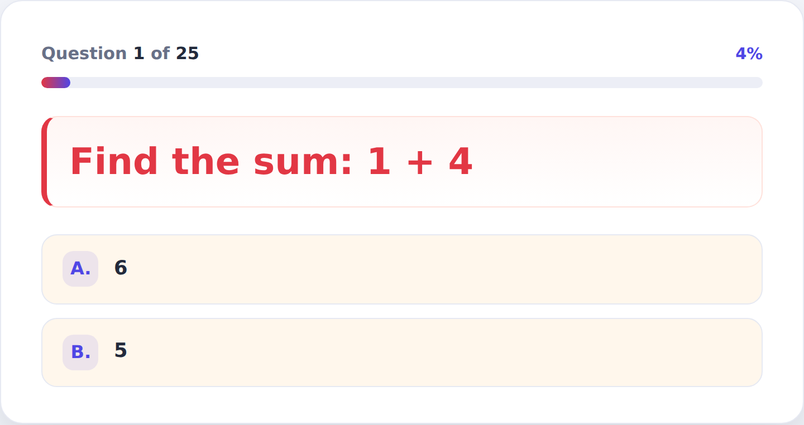

*`question/Level 1 Maths/level_1_addition_upto_5.html`*

**Page frame**
* Body background `#f4f6fb`, font `Nunito`, line-height 1.55.
* Sticky white header, `border-bottom: 4px solid #e23744`, 48 px logo, brand-red
  underline animation on nav hover. Below 900 px it becomes a hamburger + off-canvas
  drawer sliding in from the left (74 % width, max 320 px).
* Footer is **hidden entirely below 600 px** (`question.css:709-711`).

**The card — `.quiz-container`**
* White `#ffffff`, `border: 1px solid #e6e9f2`, `border-radius: 20px`,
  `box-shadow: 0 16px 40px rgba(16,24,40,.14)`.
* `padding: 2.25rem 2.25rem 2rem`, `max-width: 720px`, `margin: 3rem auto`.
* Fades in: `animation: fadeIn .4s ease` (opacity 0→1, translateY 6px→0).
* ≤768 px → `padding: 1.6rem 1.4rem; margin: 1.75rem 1.25rem`.
  ≤480 px → `padding: 1.3rem 1.15rem; margin: 1.25rem 1rem; border-radius: 14px`.

**Progress bar — `#quiz-progress`** (injected as the card's first child)
* Row: `Question **1** of **25**` on the left (Baloo 2, .95 rem, 700, grey `#687087`
  with the numbers in `#232a3b`); percentage on the right (Baloo 2, .9 rem, 800,
  indigo `#4f46e5`).
* Track: 10 px tall, `#eceef6`, fully rounded. Fill: gradient
  `linear-gradient(90deg, #e23744, #4f46e5)`, animates `width .35s`.
* Hidden on the completion screen.

**Question panel — `#question-text`** (this is the visually loudest element)
* Baloo 2, `font-size: clamp(1.5rem, 1.15rem + 1.7vw, 2.05rem)`, weight 700,
  **brand red `#e23744`**, line-height 1.35, left-aligned.
* `padding: 1.1rem 1.25rem`, `border-radius: 14px`,
  `background: linear-gradient(180deg, #fff6f4 0%, #ffffff 100%)`,
  `border: 1px solid #ffe1db`, **`border-left: 5px solid #e23744`**.
* `margin: 0 0 1.5rem`.
* On the completion screen the panel styling is removed via
  `#question-text:has(.completion-message)`.

**Options list — `.options`**
* `display: flex; flex-direction: column; gap: .75rem` — **always one per row,
  never a grid**, at every screen size, for every option count.
* Each `li`: `min-height: 56px`, `padding: .9rem 1.15rem`,
  `background: #fff7ec` (warm cream), `border: 1.5px solid #e6e9f2`,
  `border-radius: 14px`, `cursor: pointer`, `gap: .85rem`.
* Letter badge `.option-label`: 2rem × 2rem rounded square, `border-radius: 10px`,
  `background: rgba(79,70,229,.1)`, indigo text, weight 800.
* `.option-text`: `flex: 1`, 1.1 rem, weight 600.
* `.icon`: 26 × 26, pushed right with `margin-left: auto`; empty until answered.

**States**

| State | Appearance |
|---|---|
| Hover *(only on `@media (hover: hover)`)* | background `#eef2ff`, border indigo `#4f46e5`, `translateY(-2px)`, shadow `0 6px 18px`; badge tint deepens to `rgba(79,70,229,.18)` |
| Active | `transform: scale(.99)` |
| Correct | background `#e7f7ec`, border `#16a34a`, text `#14532d`, ring `0 0 0 3px rgba(22,163,74,.12)`, badge green, icon `✔️` coloured `#28a745` inline |
| Incorrect | background `#fdeaea`, border `#dc2626`, text `#7f1d1d`, ring `0 0 0 3px rgba(220,38,38,.1)`, badge red, icon `✖️` coloured `#dc3545` inline |
| Answered | `cursor: default; transform: none` on both result classes |

Hover lift is gated behind `@media (hover: hover)` so phones never get a stuck
hover state.

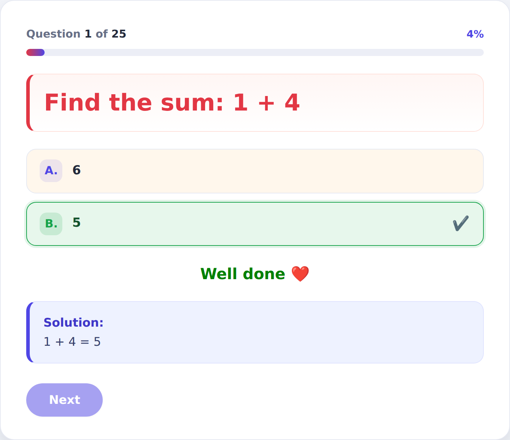
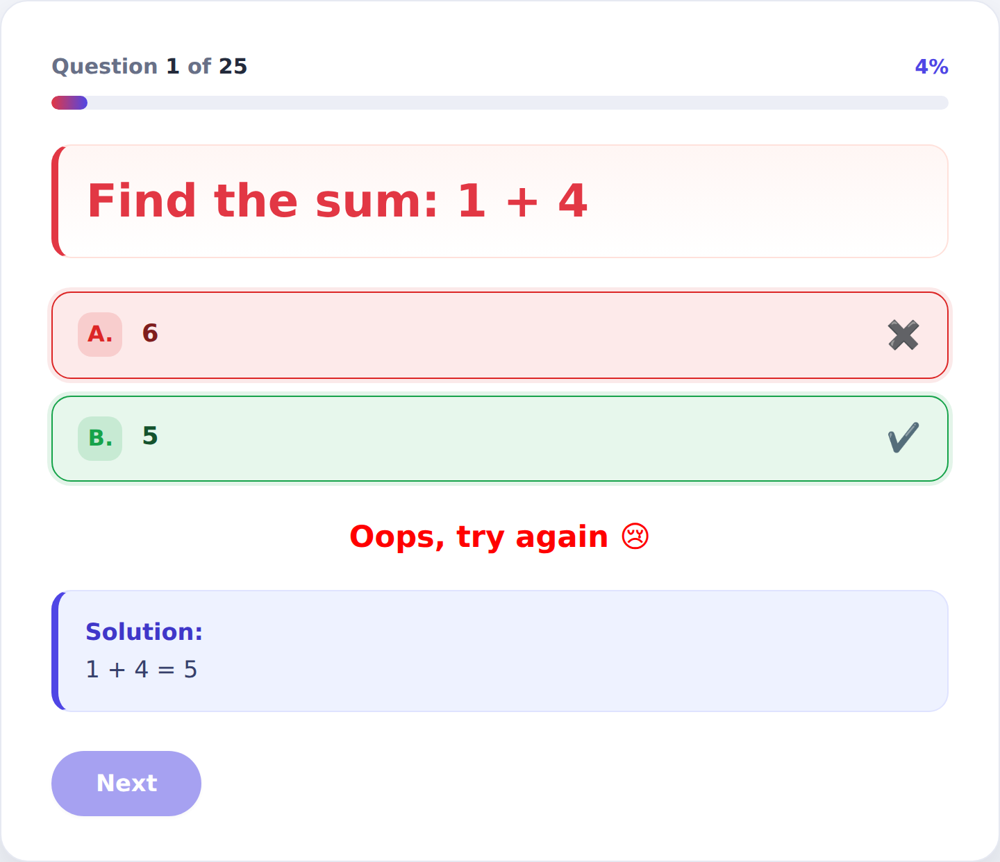

**Feedback — `#feedback`**
* Baloo 2, 700, **1.35 rem, centred**, `margin-top: 1.5rem`,
  `animation: slideIn .4s ease` (translateY −10px → 0).
* Colour is set **inline by JS** (`feedbackDiv.style.color = "green" | "red"`), which
  overrides any stylesheet colour. Note these are the CSS keywords `green`/`red`,
  **not** the design tokens `--success` `#16a34a` / `--danger` `#dc2626`.

**Explanation — `#explanation`**
* `margin-top: 1.25rem`, `padding: 1rem 1.2rem`, background `#eef2ff`,
  `border: 1px solid #dfe3ff`, **`border-left: 5px solid #4f46e5`**,
  `border-radius: 14px`, text `#36406b`, 1.05 rem, line-height 1.6, left-aligned,
  `animation: fadeIn .6s ease`. The word "Solution:" is `<strong>` in `#3f37c9`.

**Next button — `#next-btn`**
* Indigo pill: `background: #4f46e5`, white, `border-radius: 999px`,
  `padding: .85rem 2rem`, 1.05 rem, weight 700, `margin-top: 1.75rem`.
* Hover → `#3f37c9`, `translateY(-2px)`, larger shadow.
* `.is-locked` → `opacity: .5; cursor: progress; pointer-events: none` during
  the celebration.
* ≤480 px → full width.

**Emoji rain** — `#emoji-rain` is a fixed full-viewport overlay,
`pointer-events: none; z-index: 9999`. 16 `.emoji-drop` divs, each
`left: 5–85%`, `font-size: 2.4–3.8rem`, `animation: fall <1.0–1.7>s linear` with a
0–0.25 s delay. `@keyframes fall` translates `-10%` → `100vh` with a 360° rotation
and fades out.

**Completion screen**

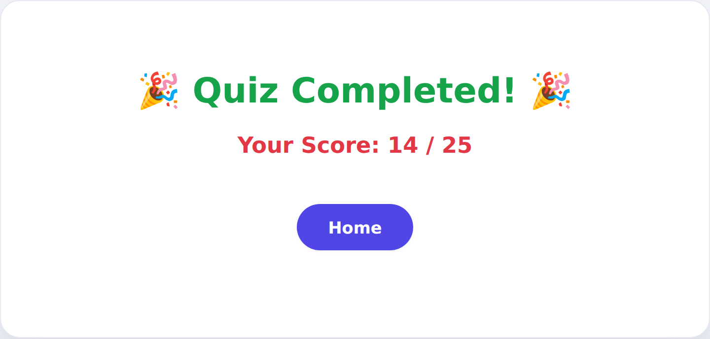

`#question-text` is replaced with `.completion-message`: centred, `padding: 2rem`,
`🎉 Quiz Completed! 🎉` as an `<h2>` in Baloo 2, green `#16a34a`,
`clamp(1.6rem, 1.2rem + 2vw, 2.2rem)`; then `Your Score: <strong>N / 25</strong>` at
1.4 rem (set inline); then a `.btn-home` indigo pill. Options, feedback,
explanation, image, progress bar and Next are all hidden.

---

### 4.3 Variant A — `mcq.plain-text` (82 files)

**The default.** `question` is a plain sentence, `options` are plain strings,
no image, no markup.

**Looks like:** exactly §4.2 with nothing extra.

**Example files**

| File | Why it's this variant |
|---|---|
| `question/Level 1 Maths/level_1_addition_upto_5.html` | `"What is 4 + 1?"` / `["6","5"]` — pure text, 2 options |
| `question/level_1_GK/level1_gk_l1.html` | `"What is the colour of the sky?"` / 3 plain options |
| `question/level-1_Science/level1_sci_universe.html` | 4 plain options, no markup |
| `question/level-1/English/level_1_eng_who_how_all.html` | `"___________ is knocking at the door?"` / `["how","who"]` — the blank is plain underscores, not markup |
| `question/Level 1 Maths/level_1_word_problems_till_20.html` | narrative word problems, 3 plain options |

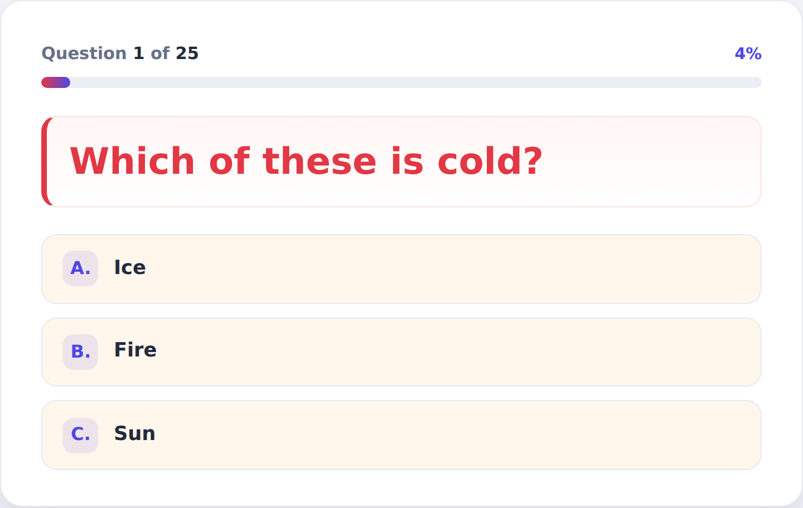
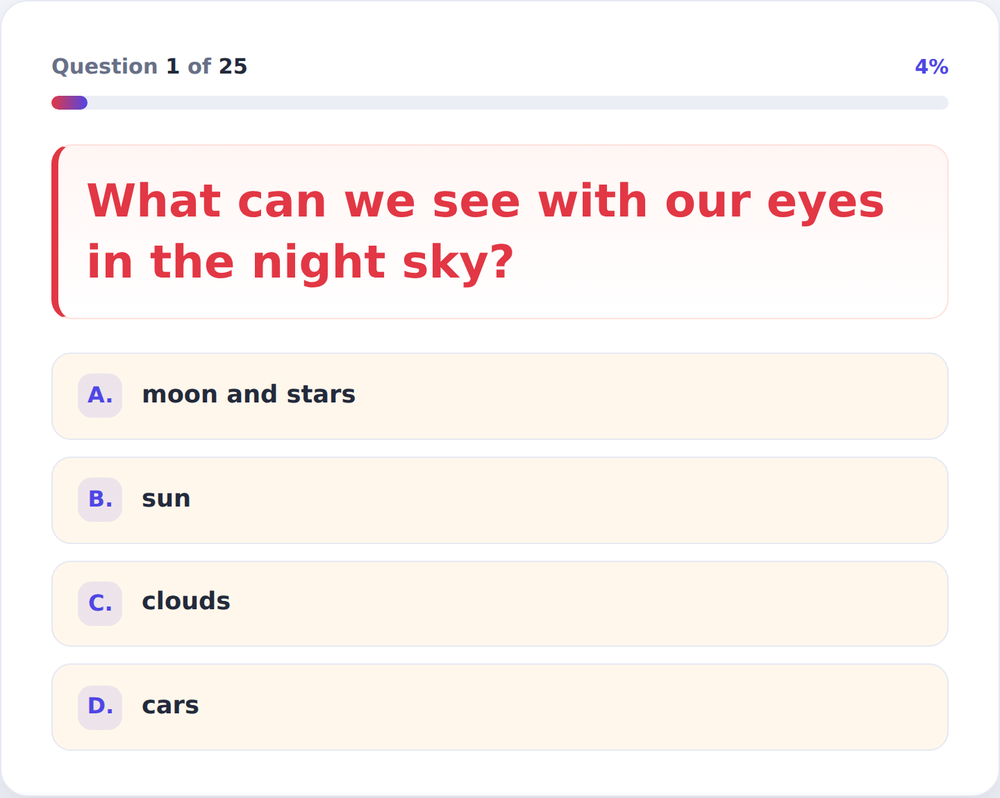

Note the layout does **not** change with option count — 2, 3 and 4 options are all a
single stacked column. Only the number of rows differs.

**Sub-shapes worth knowing when you migrate (same layout, different content rule):**

* **Fill-in-the-blank** (`fill-in-the-blank` trait, 10 files) — the gap is literal
  underscores inside the question string: `"Sam ______ cards."`. The engine does
  nothing special with it; it is just text.
  Examples: `level_1_eng_verbs_in_sentences.html` (119 q), `level_1_eng_preposition.html`,
  `level_1_eng_who_how_all.html`.
* **Category/quantity word problems** — `level_1_word_problems_till_20..50.html`,
  100 questions each, 3 numeric options.
* **"Which of the following is a…?"** sentence-selection — the options are whole
  sentences rather than words, so option rows are visually much taller.
  Examples: `level_1_eng_identify_questions.html`, `level_1_eng_identify_sentences.html`,
  `level_1_eng_common_nouns.html`.

---

### 4.4 Variant B — `mcq.rich-text-question` (32 files)

The `question` string contains **inline HTML** that the engine injects with
`innerHTML`. This is how the project gets a second line, a colour change, an
underline or a bold word into the question panel without any extra CSS class.

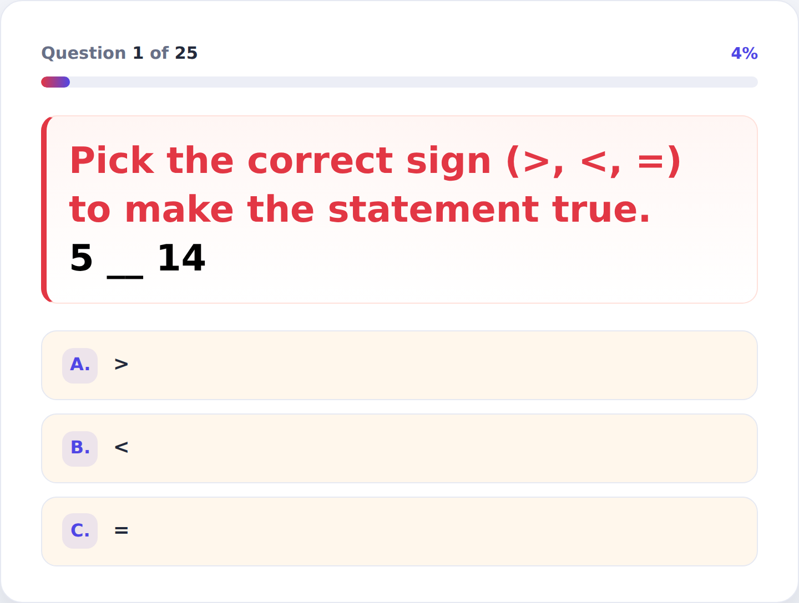

*`question/Level 1 Maths/Level_1_maths_Compare_Numbers.html`*

**The three markup idioms actually used:**

```js
// 1. Prompt on line 1, black stimulus on line 2 — by far the most common
question: "Pick the correct sign (>, <, =) to make the statement true.<br>
           <span style='color:black;'>8 __ 15</span>"

// 2. Underlined digit (place value)
question: "Identify the place value of the underlined digit. <br>
           <span style='color:black;'>6<span style='text-decoration:underline;'>9</span></span>"

// 3. Bold emphasis inside the prompt
question: "A <strong>Rectangle</strong> — how many corners does it have?"
```

**Why it matters visually:** `#question-text` is brand red by default. The
`<span style='color:black;'>` wrapper is the *only* thing making the number/sentence
being asked about render in black against the red prompt. If you drop the inline
style in a rebuild, every stimulus turns red and the exercise reads very differently.

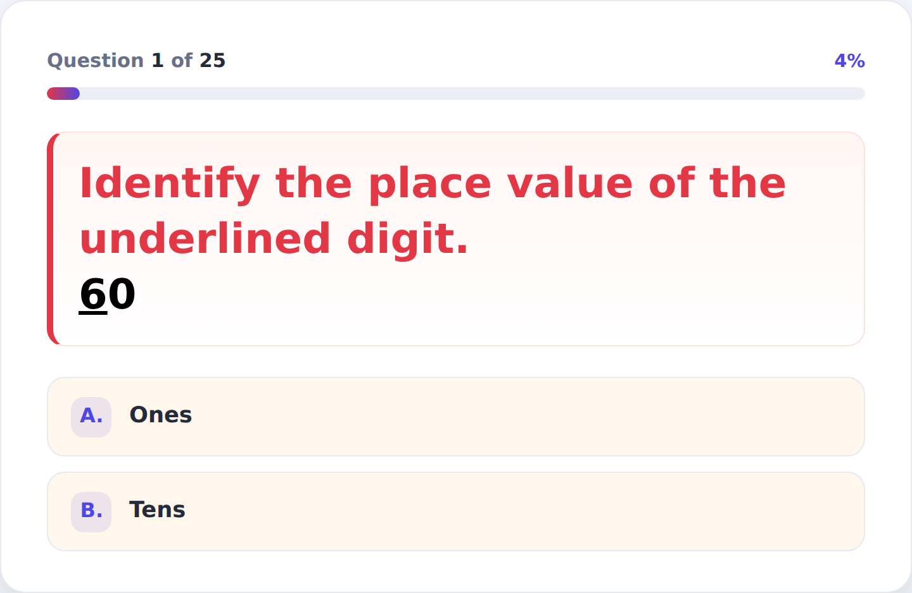

**Example files**

| File | Markup used |
|---|---|
| `Level 1 Maths/Level_1_maths_Compare_Numbers.html` | `<br>` + black span; options are `[">","<","="]` |
| `Level 1 Maths/level_1_place_value.html` | nested black span + `text-decoration:underline` |
| `Level 1 Maths/level_1_shape_recognition.html` | `<strong>` inside the prompt |
| `Level 1 Maths/level_1_convert_numbers_till_10..50.html` (5 files) | `<br>` + black span for the numeral |
| `Level 1 Maths/level_1_odd_even_till_20..100.html` (4 files) | `<br>` + black span |
| `Level 1 Maths/level_1_reading_numbers_till_10..50.html` (5 files) | `<br>` + black span |
| `level-1/English/level_1_eng_singular_plural.html` | `<br>` + black span + `___` blank |
| `level-1/English/level_1_eng_subject_pronoun.html` | `<br>` + black span |

> These 32 files were produced by `gen_questions.py`, whose `blk()` helper
> (line ~34) does exactly `"<span style='color:black;'>%s</span>"`. That is the
> origin of the idiom.

---

### 4.5 Variant C — `mcq.image-per-question` (14 files)

Each question carries its **own** picture. The engine creates a single
`` inside `.question-section`, inserted **before**
`#question-text`, and swaps its `src` per question.

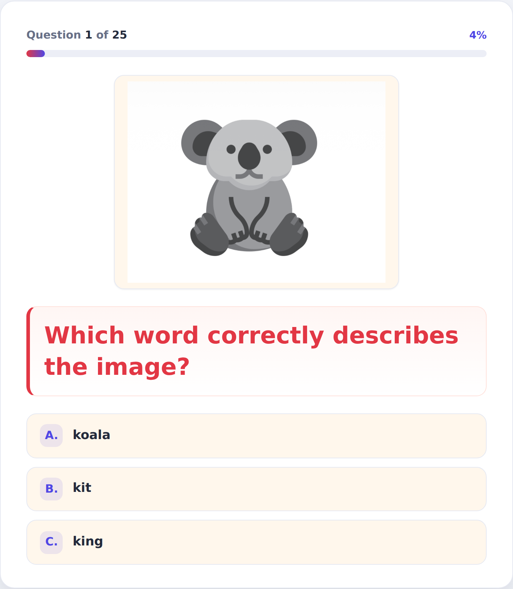

*`question/level-1/English/level1_eng_reading_vocabulary_1.html`*

**Image styling — `img.question-image` (`question.css:214`)**

```css
img.question-image {
  display: block;
  margin: 0 auto 1.5rem;        /* centred, 1.5rem below */
  width: 100%;
  max-width: 400px;
  aspect-ratio: 4 / 3;          /* box is ALWAYS 4:3 regardless of source */
  object-fit: contain;          /* source is letterboxed, never cropped */
  border-radius: 14px;
  box-shadow: 0 1px 2px rgba(16,24,40,.06);
  background: #fff7ec;          /* cream shows in the letterbox bars */
  border: 1px solid #e6e9f2;
  padding: .5rem;
}
```
Responsive: `max-width: 360px` ≤768 px, `280px` ≤480 px.

**Graceful failure:** `script.js:63` adds an `error` listener that hides the image
and strips `src` — so a missing file leaves a clean layout, no broken-image icon.
Two files rely on this today (see §8.2).

**Example files**

| File | Images | Image folder |
|---|---|---|
| `level1_eng_reading_vocabulary_1.html` | 99 unique | `image/level1_eng_reading_vocabulary_1/` |
| `level1_eng_reading_vocabulary_3.html` | 102 refs, **55 missing** | `image/level1_eng_reading_vocabulary_3/` |
| `level1_eng_reading_vocabulary_4.html` | 105 refs, **55 missing** | `image/level1_eng_reading_vocabulary_4/` |
| `level1_eng_reading_vocabulary_5.html` | 104 unique | `image/level1_eng_reading_vocabulary_5/` |
| `level1_eng_reading_vocabulary_6.html` | 99 unique | `image/level1_eng_reading_vocabulary_6/` |
| `level1_eng_vocabulary2.html` | 101 unique | `image/level1_eng_reading_vocabulary_2/` ← folder name doesn't match the file name |
| `level_1_eng_Identify_part1.html` | 50 | `image/Identify level 1 eng/` (spaces in path) |
| `level_1_eng_Identify_part2.html` | 50 | `image/Identify level 1 eng part 2/` |
| `level1_eng_identify_image_verbs.html` | 50 | `image/level1_eng_identify_image_verbs/` |
| `level1_eng_verbs_pronouns.html` | 20 | `image/level1_eng_verbs_pronouns_images/` |
| `level1_sci_critical_thinking1..4.html` | 9 / 7 / 7 / 10 | `image/level1_science_critical_thinking/critical_thinking_N/` |

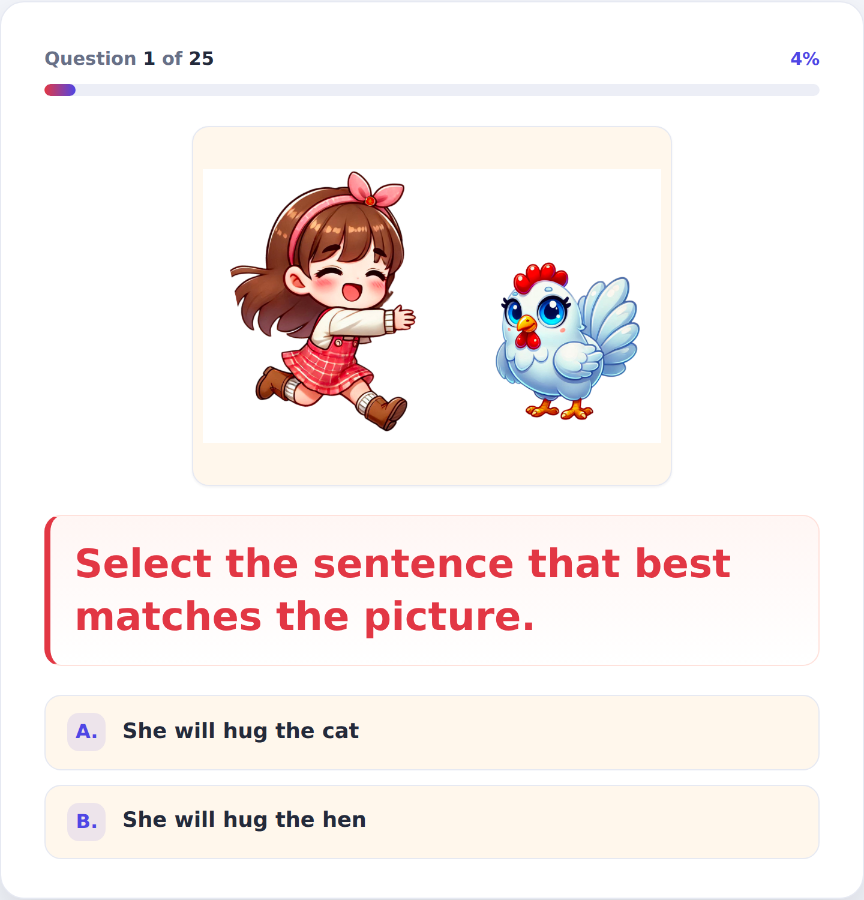

*`level_1_eng_Identify_part1.html` — same variant, but the options are full
sentences, so option rows are much taller.*

**Two sub-shapes inside this variant** (same rendering, different authoring rule):

1. **1 image ↔ 1 question** (`reading_vocabulary_*`, `Identify_part1/2`,
   `identify_image_verbs`, `verbs_pronouns`) — image count ≈ question count.
2. **1 image ↔ many questions** (`level1_sci_critical_thinking1..4`) — 110 questions
   share only 9 images; several questions interrogate the same picture
   ("What planet does the image represent?", then "What does the blue part
   represent?"). **This matters for a database:** the image is not a per-question
   attribute here, it's a shared stimulus with multiple questions attached.

---

### 4.6 Variant D — `mcq.image-shared-diagram` (4 files)

Every question in the bank points at the **same single image file** — a reference
diagram that stays on screen while the questions change around it.

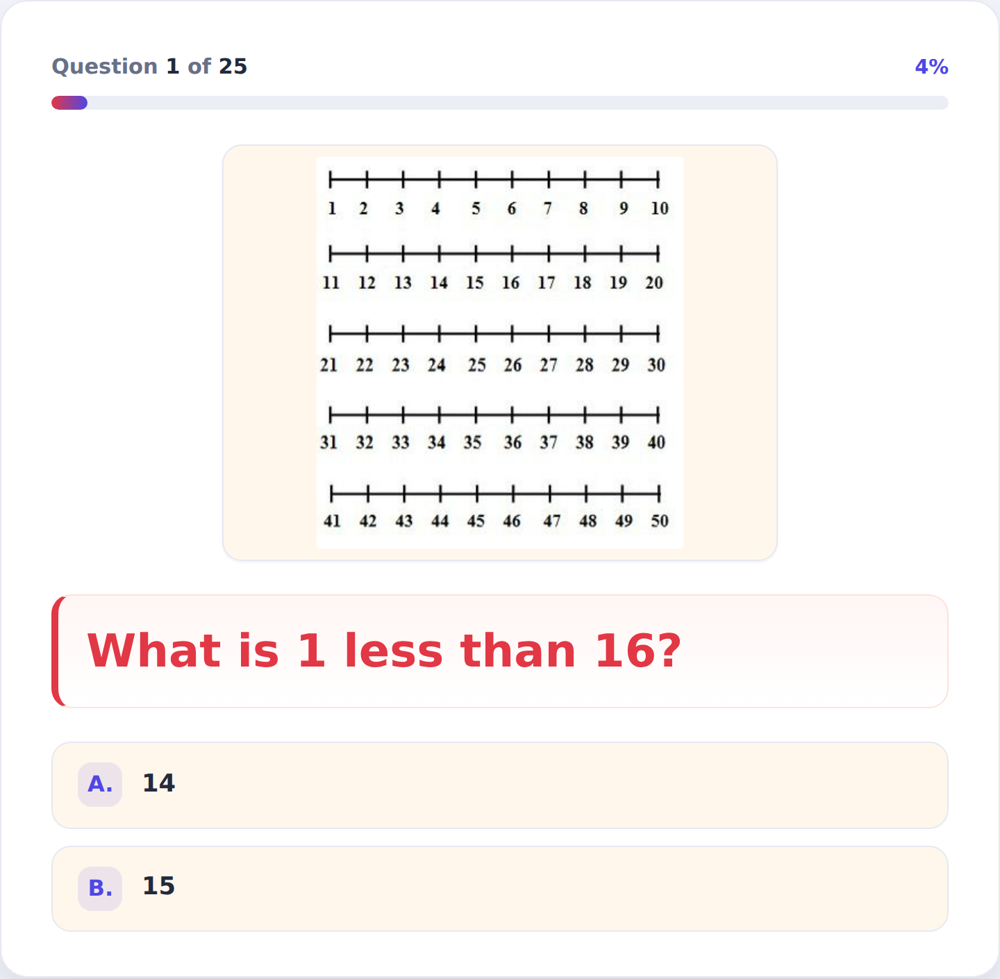

*`question/Level 1 Maths/level_1_number_line_upto_20.html`*

All 100 questions carry
`image: "../../image/level_1_math/number_line_1_to_50.jpg"`. The learner reads the
number line to answer "What is 1 more than 18?".

**Example files:** `level_1_number_line_upto_20.html`, `…_30.html`, `…_40.html`,
`…_50.html` — 100 questions each, 2 options each, 1 unique image each.

**Why it is its own variant:** in a rebuild this is an *exercise-level* asset, not a
question-level one. Storing 400 rows each repeating the same path is the current
(wasteful) representation.

---

### 4.7 Variant E — `mcq.image-story-passage` (6 files)

The most visually elaborate MCQ. `question` contains a **centred black story block**
plus a **red prompt line**, and a picture sits above it.

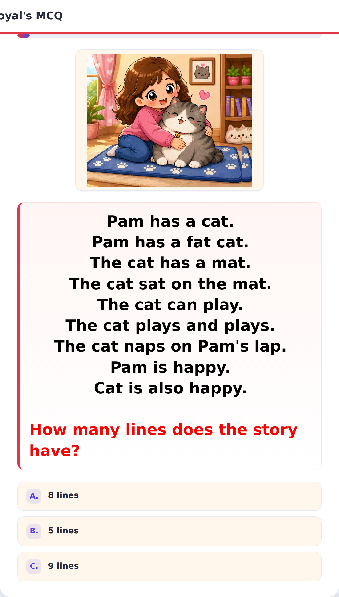

*`question/level-1/English/leve1_eng_vowels_1.html`*

```js
{
  question: "<div style=\"text-align:center; color:black;\">\n" +
            "Sam has a bag of bats.<br>\n" +
            "Pam has a bag of caps.<br>\n" +
            "Sam says, \"Pass me a cap.\"<br>\n" +
            "Pam says, \"Pass me a bat.\"<br>\n" +
            "Now, Sam and Pam can play!\n" +
            "</div><br>\n" +
            "<span style=\"color:red;\">What does Sam have?</span>",
  image: "../../../image/leve1_eng_vowels_1/1.jpeg",
  options: ["bats", "cats", "caps"],
  correct: "bats",
  explanation: "The story says Sam has a bag of bats."
}
```

**Visual result:** picture on top (400 px, 4:3, cream letterbox) → centred black
multi-line passage → blank line → the actual question in red → three cream option
rows. Everything is still inside the single red-left-bordered `#question-text` panel,
so the panel is unusually tall (question strings average **295–424 characters** in
these files vs ~15 in a math file).

**Crucially: one passage is shared by ~10 consecutive questions.** In
`leve1_eng_vowels_1.html`, 100 questions share only 11 images and 11 stories — the
passage text is duplicated verbatim in every question object.

**Example files**

| File | Questions | Unique images/stories |
|---|---:|---:|
| `leve1_eng_vowels_1.html` | 100 | 11 |
| `leve1_eng_vowels_E.html` | 100 | 10 |
| `leve1_eng_vowels_I.html` | 100 | 10 |
| `leve1_eng_vowels_O.html` | 91 | 9 (1 file missing) |
| `leve1_eng_vowels_U.html` | 100 | 10 |
| `leve1_eng_real_life.html` | 51 | 50 |

> `leve1_eng_real_life.html` is the odd one here: it uses the same wrapper markup
> but the `<div>` is **empty** — there is no story. It is really a two-panel image
> comparison; see §8.1.

---

### 4.8 Variant F — `mcq.emoji-quantity-options` (1 file)

**The "which one is bigger/more" case implemented as an MCQ.**

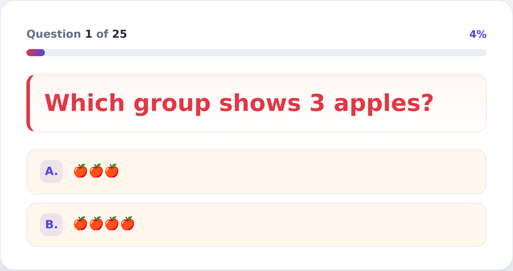

*`question/Level 1 Maths/level_1_counting_objects.html`*

```js
{
  question: "Which group shows <strong>6</strong> cookies?",
  options: ["🍪🍪🍪🍪🍪🍪🍪", "🍪🍪🍪🍪🍪🍪"],
  correct: "🍪🍪🍪🍪🍪🍪",
  explanation: "🍪🍪🍪🍪🍪🍪 shows 6 cookies."
}
```

The options are **emoji runs of different lengths** rendered as ordinary
`.option-text` — so they inherit the standard 1.1 rem option font size and appear as
two stacked cream rows containing strings of emoji. There is no special CSS.

**This is important for your rebuild** because the *same pedagogical idea*
("compare two quantities") is implemented **three different ways** in this project:

| Implementation | File | Engine | Answer key |
|---|---|---|---|
| Emoji-run options in an MCQ | `level_1_counting_objects.html` | MCQ | string equality on the emoji run |
| Two emoji groups as tap tiles | `kg3_math_more_less.html` | tap-select | `correct: true` on a tile |
| Same emoji at two font sizes | `kg3_math_big_small.html` | tap-select | `correct: true` on a tile |

They look different, are checked differently, and store differently. Treat them as
three variants, not one.

> ⚠️ Answer checking here is **exact string equality on an emoji string**. Emoji
> comparison is byte-sensitive (variation selectors, ZWJ). It works today only
> because `correct` is a copy-paste of one of the option strings. This is fragile
> and worth replacing with an index/ID in the rebuild.

---

## 5. Tap-to-select — 6 files

**Engine:** `js/tap_select.js` → `window.initTapSelectQuiz(questions)` (line 130).
**Stylesheets:** `css/question.css` + `css/tap_select.css`.
**All 6 files are KG-3 Math**, but the engine is deliberately subject-agnostic.

### 5.1 Shared structure

```html
<link rel="stylesheet" href="../../css/question.css" />
<link rel="stylesheet" href="../../css/tap_select.css" />
…
<main class="quiz-container">
  <div class="question-section">
    <h3 id="question-text">Loading...</h3>
  </div>
  <div id="tap-grid" class="tap-grid"></div>   <!-- the ONLY extra hook needed -->
  <div id="feedback" class="hidden"></div>
  <div id="explanation" class="hidden"></div>
  <button id="back-btn" class="hidden">Back</button>
  <button id="next-btn" class="hidden">Next</button>
</main>
```

All six files use **byte-identical HTML** apart from the `<title>`. The engine also
creates, if absent: `#tap-counter`, `#check-btn`, `#quiz-progress`, and
`img.question-image`.

**Data shape — two modes**

```js
// MATCH mode — tap the item(s) that fit a rule
{
  question: "Tap the triangle",
  items: [ { label: "🔽", correct: true },
           { label: "🟧", correct: false }, … ],
  layout: "row" | "column",        // optional
  image:  "…png",                  // optional scene image
  explanation: "A triangle shape is 🔻."
}

// COUNT mode — tap a given NUMBER of things
{
  question: "Tap 6 🌟 stars",
  count: 6,                        // presence of `count` selects COUNT mode
  items: ["🌟","🌟","🌟","🌟","🌟","🌟","🌟"],   // plain strings = correct:false
  explanation: "Count as you tap: 1, 2, 3, 4, 5, 6."
}
```

`normalizeItems()` (`tap_select.js:87`) turns a plain string into
`{ label: <string>, correct: false }`.

**Tile DOM built per item (`tap_select.js:295-306`):**

```html
<button type="button" class="tap-tile" data-index="0" aria-pressed="false">
  <span class="tap-label">🔺</span>
  <span class="tap-badge" aria-hidden="true"></span>
</button>
```

`label` is injected with `innerHTML`, which is what lets it carry
`<span style='font-size:3.6rem'>🍓</span>`.

**Two interaction flows, chosen automatically:**

```js
target  = countMode ? q.count : items.filter(it => it.correct).length;
instant = (target === 1);
```

| `target` | Flow |
|---|---|
| **1** | *Instant* — one tap evaluates immediately, MCQ-style. Counter and Check button stay hidden. |
| **>1** | *Multi-tap* — tiles toggle `.selected`, the live counter shows `👆 Tapped: N`, and a **Check** button (disabled until ≥1 tile) commits the answer. |

**Answer checking (`tap_select.js:344`)**

* **COUNT mode:** correct iff `chosen.length === target`. **Which** tiles were tapped
  is irrelevant — all tiles are interchangeable.
* **MATCH mode:** correct iff *every* `correct: true` tile was tapped **and** no
  `correct: false` tile was tapped. Untapped correct tiles get the `.missed` class
  (dashed green) as a gentle reveal.

### 5.2 Tap-select visual specification

**Grid — `.tap-grid`** (`tap_select.css:25`)
* Default: `display: grid; grid-template-columns: repeat(auto-fit, minmax(90px, 1fr)); gap: .85rem; margin: 1.5rem 0 .25rem`.
  ≤600 px → `minmax(74px, 1fr)`, gap `.6rem`. ≤480 px → **fixed `repeat(4, 1fr)`**.
* `.tap-grid--row` → `display: flex; flex-wrap: nowrap; justify-content: center`;
  tiles get `flex: 1 1 0`. Used when position matters — the row **never reflows**.
* `.tap-grid--column` → `display: flex; flex-direction: column; align-items: center`;
  tiles get `width: min(78%, 260px)`.
* `.tap-grid.locked .tap-tile { cursor: default; pointer-events: none }` after answering.

**Tile — `.tap-tile`**
* `min-height: 92px` (78 px ≤600 px), `padding: .75rem .5rem`,
  `background: #fff7ec`, `border: 2px solid #e6e9f2`,
  `border-radius: 20px` (14 px ≤600 px), `box-shadow: 0 1px 2px rgba(16,24,40,.06)`,
  font family Baloo 2, `user-select: none`.
* `.tap-label`: `font-size: clamp(2rem, 1.4rem + 3.5vw, 2.9rem)`, weight 700,
  centred, `line-height: 1.05`.
* `.tap-badge`: absolutely positioned `top: 6px; right: 8px`, 1.15 rem — holds
  `✔️` / `✖️` after checking.

| State | Appearance |
|---|---|
| Hover *(hover devices only)* | border `#4f46e5`, background `#eef2ff`, `translateY(-3px)`, shadow `0 6px 18px` |
| Active | `scale(.97)` |
| `.selected` | border `#4f46e5`, background `#eef2ff`, ring `0 0 0 3px rgba(79,70,229,.25)`, `translateY(-2px)` |
| `.correct` | border `#16a34a`, background `#e7f7ec`, text `#14532d`, ring `0 0 0 3px rgba(22,163,74,.18)` |
| `.incorrect` | border `#dc2626`, background `#fdeaea`, text `#7f1d1d`, ring `0 0 0 3px rgba(220,38,38,.14)` |
| `.missed` | border `#16a34a` **dashed**, background `#e7f7ec`, text `#14532d` — "you should have tapped this too" |

**Counter — `#tap-counter`** — indigo pill: `background: #eef2ff`,
`border: 1px solid #dfe3ff`, `border-radius: 999px`, `padding: .4rem .9rem`,
Baloo 2 700, 1.05 rem, text `#3f37c9`, content `👆 Tapped: <strong>N</strong>`.
Only shown in multi-tap flows.

**Check button — `#check-btn`** — inherits the shared pill from
`.quiz-container > button:not(#back-btn)` but is recoloured **brand red `#e23744`**
(hover `#c01f2d`) so it reads as a different action from the indigo Next.
`.is-disabled` → `opacity: .5; cursor: not-allowed`.
≤480 px → full width, stacked above Next.

**Scene span — `.tap-scene`** — for emoji drawn *inside* the question text:
`display: block; margin-top: .6rem; font-size: clamp(2rem, 1.5rem + 3vw, 3rem); letter-spacing: .12em`.

---

### 5.3 Variant A — `tap.size-compare` (1 file)

**This is the "which one is bigger" exercise.**

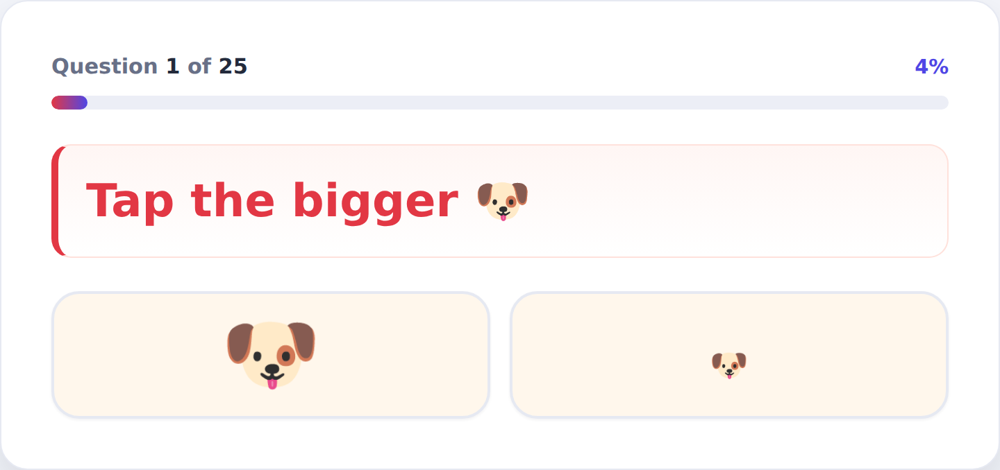

*`question/KG-3_math/kg3_math_big_small.html`*

```js
{
  question: "Tap the biggest 🍓",
  layout: "row",
  items: [
    { label: "<span style='font-size:3.6rem'>🍓</span>", correct: true  },
    { label: "<span style='font-size:2.4rem'>🍓</span>", correct: false },
    { label: "<span style='font-size:1.4rem'>🍓</span>", correct: false }
  ],
  explanation: "Find the biggest 🍓."
}
```

**The mechanism:** the *same* emoji is repeated in each tile; the only difference is
an **inline `font-size` on a `<span>` inside the label**. Three sizes are used across
the whole bank and nothing else:

| Size | Role |
|---|---|
| `3.6rem` | biggest |
| `2.4rem` | middle (3-tile questions only) |
| `1.4rem` | smallest |

The tile itself does not change size — `min-height: 92px` and `flex: 1 1 0` keep all
tiles identical. Only the glyph inside grows or shrinks, so the tiles read as
equal-sized frames holding different-sized pictures.

**Bank composition:** 100 questions — **70 with 2 tiles, 30 with 3 tiles**.
Every question has exactly one correct tile → always the *instant* flow (single tap,
no Check button, no counter).

**Prompt wording maps to the answer:** `"Tap the bigger X"` / `"Tap the biggest X"` /
`"Tap the smaller X"` / `"Tap the smallest X"`. The comparative forms appear on
2-tile questions, superlatives on 3-tile ones.

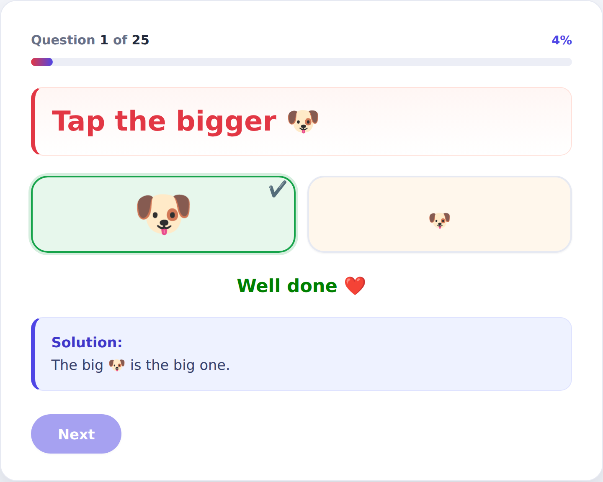

> ⚠️ **The inline `font-size` is the entire content of this exercise.** If a
> migration strips inline styles from the label, all tiles become identical and the
> exercise becomes unanswerable. In a rebuild, store this as structured data —
> e.g. `{ emoji: "🍓", sizes: [3.6, 2.4, 1.4], correctIndex: 0 }` — not as HTML.

---

### 5.4 Variant B — `tap.quantity-compare` (1 file)

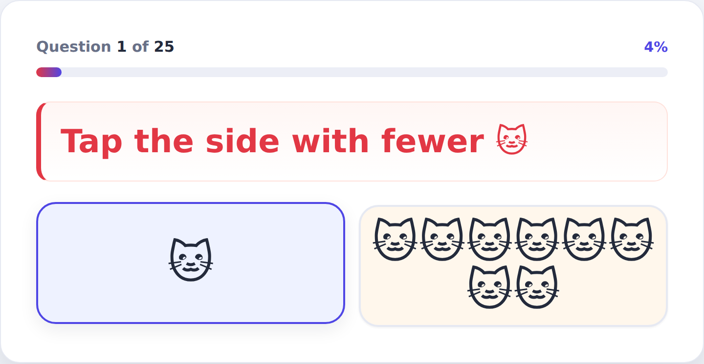

*`question/KG-3_math/kg3_math_more_less.html`*

```js
{
  question: "Tap the side with fewer ⭐",
  layout: "row",
  items: [ { label: "⭐",  correct: true },
           { label: "⭐⭐", correct: false } ],
  explanation: "1 is fewer than 2, so tap the side with 1 ⭐."
}
```

Same engine and same `layout: "row"` as size-compare, but the difference between
tiles is the **number of repeated emoji**, at the default tile font size — not the
font size. All 100 questions have exactly **2 tiles**, always one correct → instant
flow.

Kept separate from size-compare because the data is different in kind
(a *count*, not a *scale*) and a rebuild would model it differently.

---

### 5.5 Variant C — `tap.grid-match` (1 file)

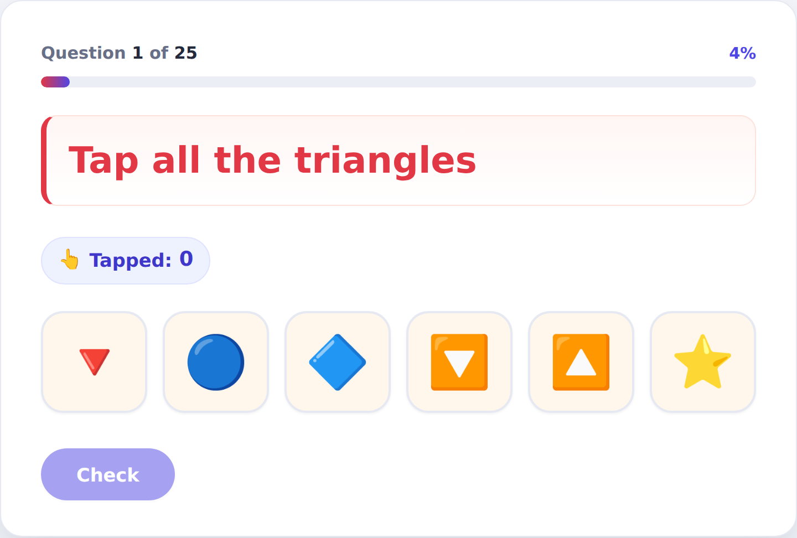

*`question/KG-3_math/kg3_math_shapes.html`*

```js
{ question: "Tap the triangle",
  items: [ { label: "🔽", correct: true }, { label: "🟧", correct: false },
           { label: "⭐", correct: false }, { label: "❤️", correct: false } ],
  explanation: "A triangle shape is 🔻." }
```

No `layout` key → the **default responsive auto-fit grid**. Tile counts vary:
**60 questions with 4 tiles, 25 with 5, 15 with 6.**

**The only file in the repo with multi-correct questions:** 60 questions have one
correct tile (instant flow), **40 have more than one** (multi-tap flow with the
counter and the Check button). Both flows appear in the same exercise, chosen
per-question at render time.

This is the variant that exercises the `.missed` state — untapped correct tiles get
a dashed green border after checking.

---

### 5.6 Variant D — `tap.count-n` (1 file)

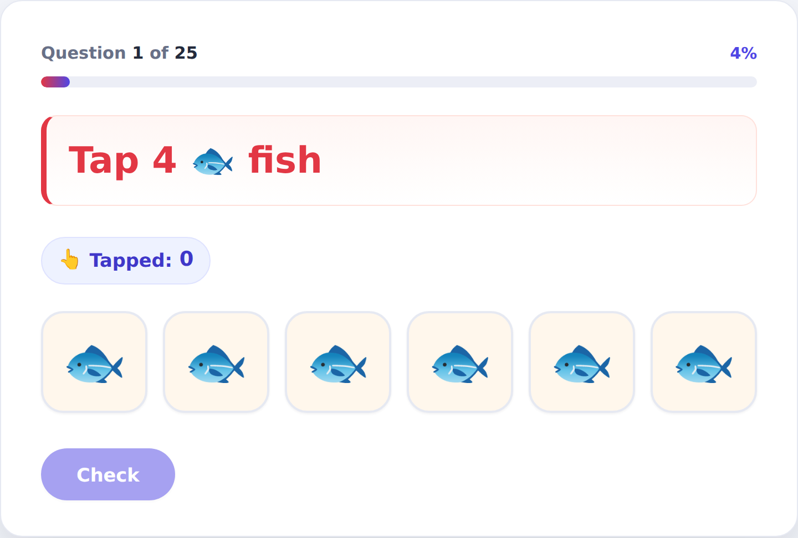
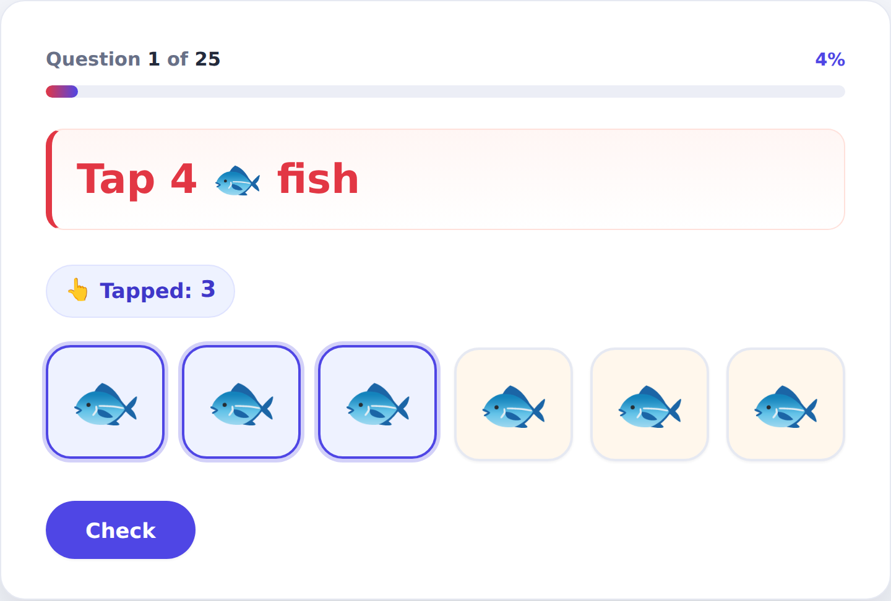

*`question/KG-3_math/kg3_math_tap_and_count.html`*

```js
{ question: "Tap 6 🌟 stars",
  count: 6,
  items: ["🌟","🌟","🌟","🌟","🌟","🌟","🌟"],   // plain strings, all identical
  explanation: "Count as you tap: 1, 2, 3, 4, 5, 6. That makes six (6) stars." }
```

**The only file using COUNT mode** (`count` key present on all 100 questions) and
**the only file whose `items` are plain strings** rather than objects.

* Always multi-tap: the counter (`👆 Tapped: N`) and the Check button are always
  visible.
* Correctness is `chosen.length === count` — any tiles count.
* Tile counts range from **2 to 12** (most common: 6 and 4), so this exercise has the
  widest visual range; on a phone (≤480 px) the fixed `repeat(4, 1fr)` grid turns a
  12-tile question into 3 rows of 4.

---

### 5.7 Variant E — `tap.spatial` (1 file)

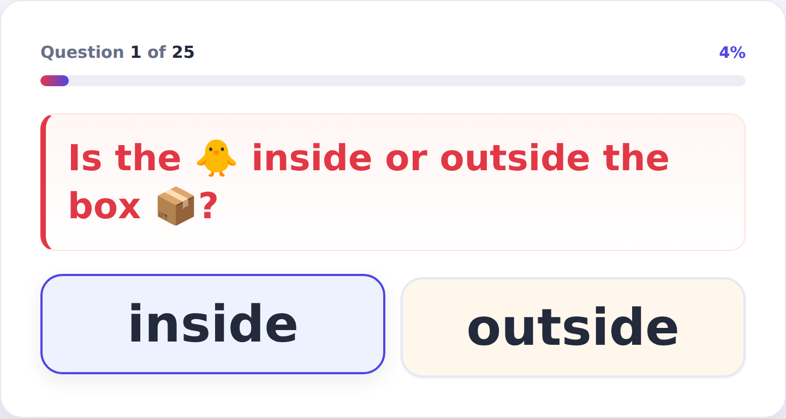

*`question/KG-3_math/kg3_math_position.html`*

```js
{ question: "Tap the picture at the BOTTOM",
  layout: "column",
  items: [ { label: "🍌", correct: false },
           { label: "🐝", correct: false },
           { label: "🚗", correct: true } ],
  explanation: "The picture at the bottom (below) is 🚗." }
```

The **only file using `layout: "column"`** and the only tap-select file with an
`image` key. Composition of the 100-question bank:

| | Count |
|---|---:|
| `layout: "column"` | 50 |
| `layout: "row"` | 34 |
| no layout (default grid) | 16 |
| with `image` (in/out of box scenes) | 16 |
| 2 tiles / 3 tiles | 36 / 64 |

The layout key is load-bearing: for "top/bottom" questions the tiles must stack
vertically and must not reflow, which is what `.tap-grid--column` guarantees.

> ⚠️ **All 16 images in this file are missing from the repo**
> (`image/kg3_math/position/*.png` — the folder does not exist). Those 16 questions
> currently render with no picture, because `tap_select.js:165` hides an image that
> fails to load. The question text still makes sense, so it is not visibly broken —
> but 16 % of this exercise is incomplete. See §8.2.

---

### 5.8 Variant F — `tap.scene-count` (1 file)

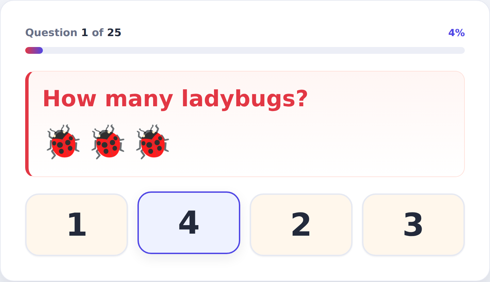

*`question/KG-3_math/kg3_math_how_many.html`*

```js
{ question: "How many cars?<br><span class=\"tap-scene\">🚗🚗🚗</span>",
  items: [ { label: "3", correct: true }, { label: "4", correct: false },
           { label: "1", correct: false }, { label: "2", correct: false } ],
  explanation: "Count them: 1, 2, 3. There are three (3) cars." }
```

Inverted from the other tap variants: **the emoji live in the question**, and the
tiles hold **numerals**. `.tap-scene` renders them as a block at
`clamp(2rem, 1.5rem + 3vw, 3rem)` with `letter-spacing: .12em` under the prompt,
inside the red question panel.

All 100 questions have exactly 4 numeral tiles and one correct answer → instant flow.
Functionally this is a 4-option MCQ wearing tap-select clothes; visually the tiles
are big square buttons in a grid rather than stacked rows.

---

## 6. Drag & drop — 4 files

**Engine:** `js/drag_and_drop.js` — two separate init functions.
**Stylesheets:** `css/question.css` + `css/dnd.css`.
All 4 files are Level 1 English.

### 6.1 What is different about drag & drop

This engine does **not** share the session contract described in §1.3:

| | MCQ / tap / audio | Drag & drop |
|---|---|---|
| Random 25 of 100 | ✅ | ❌ — whole bank, in file order |
| Shuffles questions | ✅ | ❌ |
| Progress bar | ✅ injected | ❌ never created |
| Bank size | ~100 | 20 / 25 / 3 |

So a DnD exercise is a fixed, ordered, complete run of its bank.

### 6.2 The drag interaction (`enableKidDrag`, `drag_and_drop.js:68`)

Native HTML5 drag is **explicitly disabled** (`d.draggable = false`); everything is
custom Pointer Events, tuned for small children:

* **Mouse / pen:** pick up immediately on `pointerdown`.
* **Touch:** requires a deliberate **250 ms long press** (`LONG_PRESS_MS`). Moving
  more than **16 px** (`MOVE_CANCEL`) during the hold cancels it, so scrolling and
  tapping never start an accidental drag. During the hold the chip gets `.pressing`
  (`transform: scale(1.12)`).
* On activation a **clone** of the chip is appended to `<body>` with `.drag-clone`
  and follows the pointer; the original gets `.dragging` (`opacity: .35`).
  `document.body` gets `.dnd-active` which forces `cursor: grabbing` and blocks
  selection page-wide. A `navigator.vibrate(8)` haptic fires if supported.
* Drop targets are found with `document.elementFromPoint()` + `closest(dropSelector)`
  (the clone has `pointer-events: none`), and the hovered target gets `.over`.
* On release `opts.onDrop(chip, target)` runs.

### 6.3 Visual specification

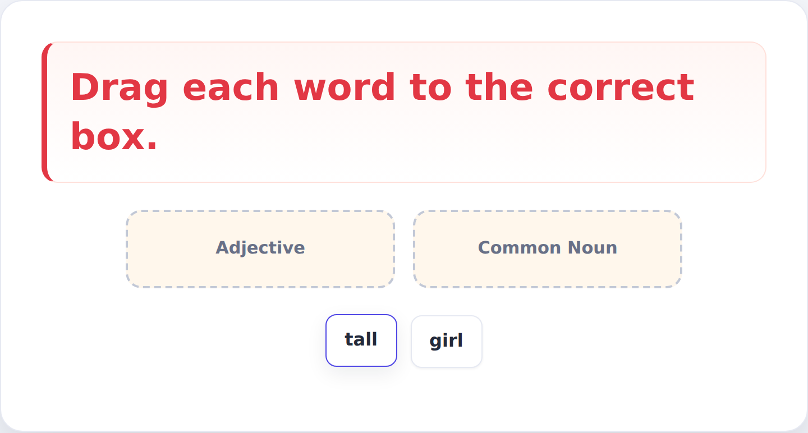

**Drop boxes — `.two-targets` / `.dropbox`** (`dnd.css:51`)
* Container: `display: grid; grid-template-columns: repeat(2, minmax(160px, 240px)); justify-content: center; gap: 1rem`.
* Box: `min-height: 70px`, `padding: .6rem`, **`border: 2px dashed #c2c8d6`**,
  `border-radius: 14px`, `background: #fff7ec`, centred flex, weight 700.
* The placeholder text ("Adjective", "Common Noun") is **not a DOM node** — it is
  `.dropbox::after { content: attr(data-placeholder) }`, absolutely positioned and
  `pointer-events: none`. Once a chip lands, `.has-value::after { content: "" }`
  clears it.
* States: `.over` → solid indigo border + `#eef2ff`; `.correct` → solid green
  `#16a34a` + `#e7f7ec`; **`.wrong`** → solid red `#dc2626` + `#fdeaea`.
  *(Note the multi-box engine uses `.wrong`, while the single-`dropzone` engine uses
  `.incorrect` — see §9.4.)*

**Auto-condensing for 3 and 4 boxes** (`dnd.css:220`, `:has()` based):

| Boxes | ≥681 px columns | Box width | Font |
|---|---|---|---|
| 2 | `repeat(2, minmax(160px,240px))` | – | 1rem |
| 3 | `repeat(3, minmax(120px,180px))` | `clamp(120px,18vw,180px)`, min-height 58px | .9rem |
| 4 | `repeat(4, minmax(100px,150px))` | `clamp(100px,14vw,150px)`, min-height 54px | .85rem |

≤680 px all layouts collapse to **one box per row**, `width: clamp(220px, 82vw, 300px)`,
`min-height: 66px`.

**Chips — `#choices` / `.draggable`**
* Row: `display: flex; flex-wrap: wrap; justify-content: center; gap: .7rem; max-width: 720px; min-height: 2.6rem`.
* Chip: white `#ffffff`, `border: 1.5px solid #e6e9f2`, `border-radius: 10px`,
  `padding: .65rem 1rem`, `min-height: 44px`, weight 700, `cursor: grab`,
  `touch-action: none`, `user-select: none`.
* `.used` → `opacity: .55; pointer-events: none` (applied to every chip once the
  question is resolved).
* `.drag-clone` → `position: fixed; z-index: 10000`, indigo border, big shadow,
  `transform: scale(1.06) rotate(-2deg)`, `opacity: .98`.

**Feedback wording differs from MCQ:** `"✅ Correct!"` / `"😢 Oops wrong answer"`
(vs `"Well done ❤️"` / `"Oops, try again 😢"`), centred, green/red inline.

---

### 6.4 Variant A — `dnd.sort-two-box` (2 files)

```html
<div class="two-targets">
  <div class="dropbox" data-box="left"  data-placeholder="Adjective"></div>
  <div class="dropbox" data-box="right" data-placeholder="Common Noun"></div>
</div>
<div id="choices"></div>
```

```js
{ question: "Drag each word to the correct box.",
  options: ["tall", "girl"],
  key: { "tall": "left", "girl": "right" },
  explanation: "'tall' is an adjective; 'girl' is a common noun." }
```

**Answer model (`initTwoBoxSortQuiz`, `drag_and_drop.js:310`)**

`resolveCorrectTarget(q, word)`:
1. If `q.key[word]` exists → that is the expected `data-box`.
2. Otherwise, if `q.options.length === dropboxes.length` → `options[i]` belongs in
   `dropboxes[i]`.
3. Otherwise `"unknown"` (always wrong).

Correct iff `resolveCorrectTarget(...) === box.dataset.box`.

**Scoring is all-or-nothing and unforgiving:**
* A **wrong** drop immediately locks the question (`locked = true`), disables all
  dragging, shows the explanation and reveals Next. **No score.**
* Only when *every* dropbox is `.has-value` **and** `.correct` does `correctCount++`.
* Success rain is *gated*: `addEmojiRain` (`drag_and_drop.js:8`) returns early unless
  every `.dropbox` in scope is both `has-value` and `correct` — unless `{force:true}`
  is passed, which the failure path does.

**Example files**

| File | Boxes | Placeholders | Questions |
|---|---|---|---|
| `level_1_eng_drag_and_drop_adjective-common_nouns.html` | `left`, `right` | Adjective / Common Noun | 20 |
| `level_1_eng_drag_and_drop_proper-common_nouns.html` | `left`, `right` | Proper Noun / Common Noun | 20 |

Both files carry a **stray `initMCQQuiz(questions)` call** after the footer script —
see §9.3.

---

### 6.5 Variant B — `dnd.order-four-box` (1 file)

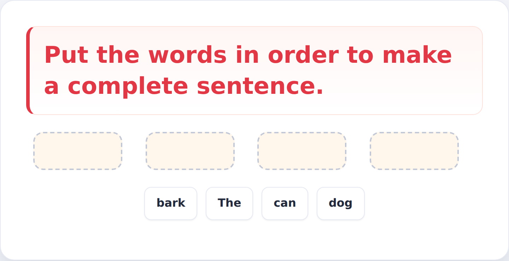

*`question/level-1/English/level1_eng_drag_&_drop/level_1_eng_drag_and_drop_scrambled_words.html`*

```html
<div class="two-targets">
  <div class="dropbox" data-box="first"  data-placeholder=""></div>
  <div class="dropbox" data-box="second" data-placeholder=""></div>
  <div class="dropbox" data-box="third"  data-placeholder=""></div>
  <div class="dropbox" data-box="forth"  data-placeholder=""></div>
</div>
```

```js
{ question: "Put the words in order to make a complete sentence.",
  options: ["bark","The","can","dog"],                        // scrambled
  key: { "The":"first", "dog":"second", "can":"third", "bark":"forth" },
  explanation: "'The dog can bark' is the correct order." }
```

Same engine (`initTwoBoxSortQuiz`) — "two box" is a misnomer, it handles any number
of `.dropbox` elements. Differences from Variant A:

* **4 boxes, not 2**, so `dnd.css`'s `:has(.dropbox:nth-child(4))` rule kicks in:
  narrower boxes (`clamp(100px,14vw,150px)`), `min-height: 54px`, `.85rem` font.
* `data-placeholder=""` — **the boxes are empty**, since position is the meaning,
  not a category name.
* `data-box` values are ordinals: `first / second / third / forth`
  (**"forth" is a typo for "fourth"** — but it is consistent between the HTML and
  every `key`, so it works; carry the spelling or change both).
* 25 questions, all 4 options, all 4 boxes.
* Init is wrapped in `DOMContentLoaded` and namespaced (`window.initTwoBoxSortQuiz`),
  unlike the two-box files.

---

### 6.6 Variant C — `dnd.mixed-demo` (1 file, not a shipped exercise)

`question/level-1/English/level1_eng_drag_&_drop/example.html` — 3 questions,
4 dropboxes, and **four init calls in one page**: `initTwoBoxSortQuiz` twice,
`initDragDropQuiz` once, and `initTwoBoxSortQuiz` again. Not linked from any menu.
See §8.4.

**It is the only place `initDragDropQuiz` is referenced at all.** That engine
(`drag_and_drop.js:185`) implements a *different* variant that is **not used by any
live exercise**:

* The question string contains `…` (ellipsis), which `loadQuestion()` replaces with
  `<span id="dropzone" class="dropzone"></span>` — an **inline blank inside the
  sentence**.
* One chip is dropped into that single inline blank; `q.correct` is a plain string.
* Styling: `.dropzone` — `display: inline-flex; min-width: 130px; height: 46px;
  border: 2px dashed #c2c8d6; border-radius: 14px; background: #fff7ec;
  vertical-align: middle`. States use `.correct` / **`.incorrect`**.

If you want a "fill the blank by dragging" exercise type in the rebuild, the engine
and CSS already exist and are documented here — but **no content uses it today**.

---

## 7. Audio / listen-and-choose — 3 files

**Engine:** `js/audio.js` — **no init call**; the script runs top-to-bottom on load
and reads the global `questions` (or `QUIZ_DATA`) that the page declared earlier.
**Stylesheets:** `css/audio_style.css` + `css/index.css` — **not `question.css`**.

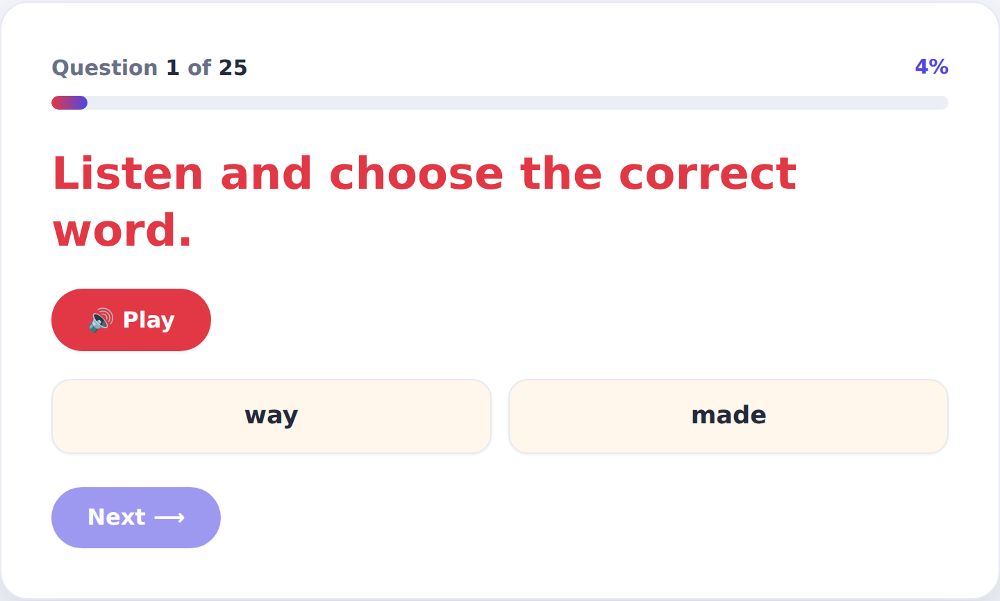

*`question/level-1/English/level1_eng_sight_words/level_1_eng_sight_words1.html`*

### 7.1 Structure

```html
<link rel="stylesheet" href="…/css/audio_style.css" />
<link rel="stylesheet" href="…/css/index.css" />
…
<main>
  <section class="quiz-container" aria-live="polite">
    <h3 id="instruction">Listen and choose the correct word.</h3>
    <div class="controls-row">
      <button id="playBtn" class="btn primary" aria-label="Play audio">🔊 Play</button>
    </div>
    
    <div id="options" class="options"></div>
    <div id="feedback" class="feedback" role="status"></div>
    <div id="explanation" class="hidden"></div>
    <div class="nav-row">
      <button id="prevBtn" class="btn" type="button">⟵ Prev</button>
      <div class="progress"><span id="index">1</span> / <span id="total">1</span></div>
      <button id="nextBtn" class="btn" type="button">Next ⟶</button>
    </div>
  </section>
</main>
```

Note the **completely different DOM contract** from every other engine:
`#instruction` not `#question-text`, `#options` (a `div`) not `#options-list` (a
`ul`), `#nextBtn` not `#next-btn`, `#qimg` not an injected `img.question-image`.

At load, `audio.js` removes `#prevBtn` and hides the raw `1 / 100` counter, replacing
it with the shared `#quiz-progress` bar.

### 7.2 Data shape — and how it is authored

```js
{ question: "Listen and choose the correct word.",
  voice:    "the",            // the string spoken by the Web Speech API
  options:  ["the", "at"],
  correct:  "the",
  lang:     "en-US" }         // also accepted: rate, pitch, image, utterance
```

**All 3 files build their bank programmatically** rather than listing question
objects — the only exercises in the repo that do:

```js
const SW = ["the","at","there", … ];      // 100 Fry sight words
const questions = SW.map((w, i) => {
  const distractor = SW[(i + 1) % SW.length];
  return { question: "Listen and choose the correct word.",
           voice: w, options: [w, distractor], correct: w, lang: "en-US" };
});
```

Consequences worth knowing: the correct answer is **always `options[0]`** in all 300
questions, and none of the three files has an `explanation`.

`normalizeInput()` (`audio.js:504`) fills defaults and, as a safety net, prepends
`correct` to `options` if it isn't present.

### 7.3 Interaction

* **🔊 Play** → `speakText(q.voice, …)` via `SpeechSynthesisUtterance`. Voice
  selection is per-browser (`VOICE_PREFS`: Google US English for Chrome,
  Microsoft Christopher Natural for Edge, Samantha for Safari), falling back through
  Google → Microsoft → any `en-US` → any `en`. Rate is clamped to 0.7–1.2 and pitch
  to 0.5–2.0 (`audio.js:359`) — deliberately slowed for children.
* Answer checking is **case-insensitive and trimmed** (`norm()`), unlike every other
  engine's strict `===`:
  ```js
  const isRight = norm(chosen) === norm(q.correct);
  ```
* On answer: the correct button gets `.correct`, the chosen-and-wrong button gets
  **`.wrong`**, and every button is `disabled = true`.
* **Next is disabled until an answer is given** (`nextBtn.disabled = true` +
  `.is-disabled`) — and `loadNextQuestion()` additionally refuses to advance,
  showing `"Please choose an option before proceeding."`. This forced-answer gate
  exists only in the audio engine.
* Emoji rain here is a **different implementation** from the other engines: 50
  drops by default (16 passed), all styles set inline, `emoji-fall` keyframes over
  2–5 s. It does not lock Next.

### 7.4 Visual specification

Because these pages load `audio_style.css` instead of `question.css`, several things
look different from every other exercise:

| | MCQ pages | Audio pages |
|---|---|---|
| Question heading | red panel with left border, in `#question-text` | **plain `h3`**, brand red, no panel, no border, no background |
| Options container | `flex column`, one per row | **`grid` `repeat(auto-fit, minmax(150px, 1fr))`** — 2 across on desktop, 1 across ≤480 px |
| Option element | `<li>` with A./B. badge + tick icon | **`<button>`**, centred text, **no letter badge, no icon** |
| Wrong-answer class | `.incorrect` | **`.wrong`** |
| Card width | `max-width: 720px`, `width: auto` | `max-width: 720px`, `width: 100%` |

* `.options button`: `background: #fff7ec`, `border: 1.5px solid #e6e9f2`,
  `border-radius: 14px`, `padding: 1rem 1.2rem`, 1.1 rem, weight 700, centred.
  Hover → `#eef2ff` + indigo border + `translateY(-2px)` (**not** gated behind
  `@media (hover: hover)`, so phones can get a stuck hover state here).
* `#playBtn.btn.primary`: **brand red pill** `#e23744` (hover `#c01f2d`),
  `border-radius: 999px`, `padding: .8rem 1.6rem`, content `🔊 Play`.
* `.nav-row`: `display: flex; justify-content: space-between` holding Prev
  (removed at runtime), the progress counter (hidden at runtime) and Next.
* `.feedback.good` → `#16a34a`; `.feedback.bad` → `#dc2626` — but `setFeedback()`
  then overwrites with inline `green` / `red` anyway.
* `#voice { display: none !important; }` — a voice-picker dropdown that was designed
  and then hidden.

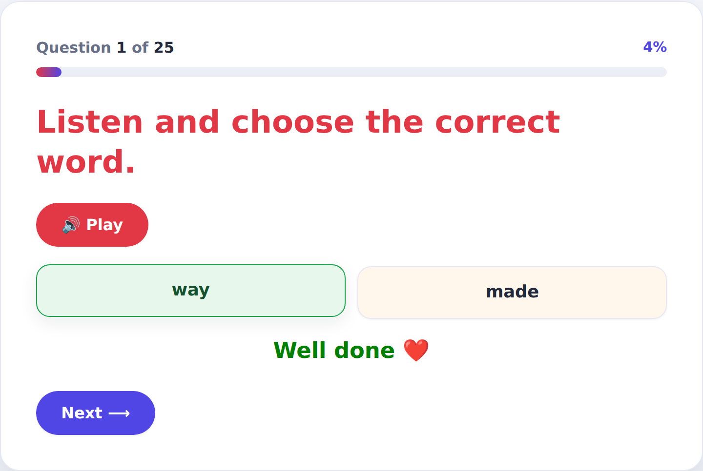

**Example files:** `level_1_eng_sight_words1.html`, `…2.html`, `…3.html` — 100
questions each, the first 100 / second 100 / third 100 Fry sight words.

---

## 8. Outliers and special cases

### 8.1 `leve1_eng_real_life.html` — a two-panel image comparison in disguise

`question/level-1/English/leve1_eng_real_life.html`

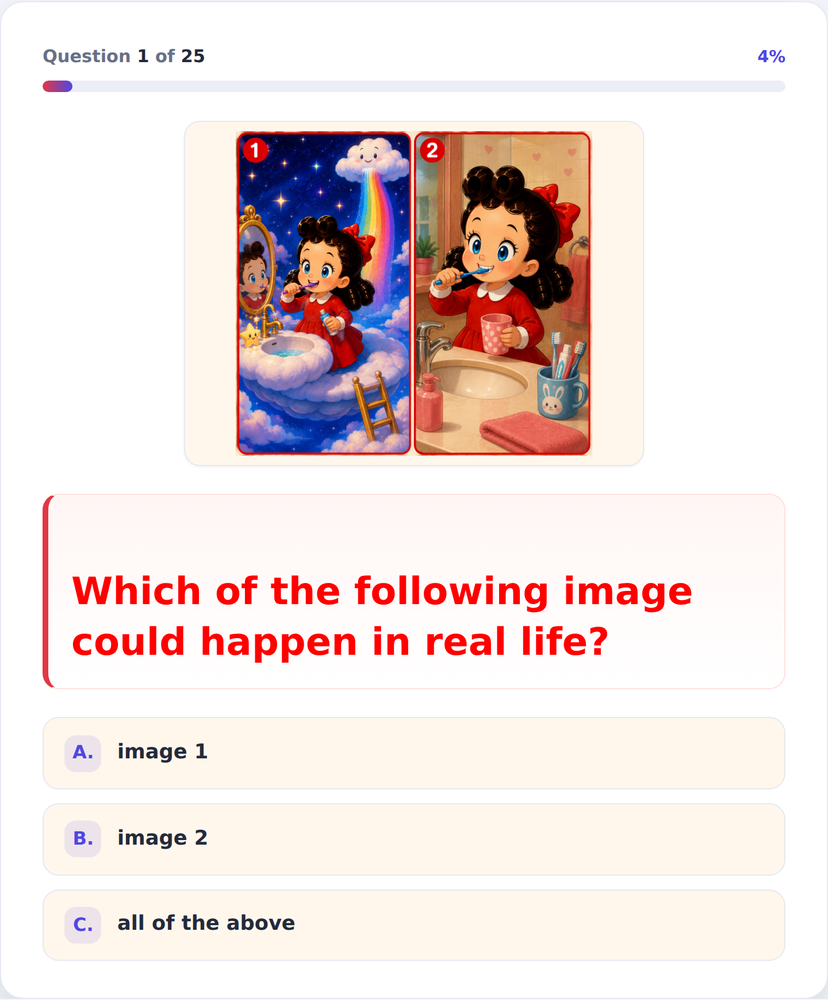

```js
{ question: "<div style=\"text-align:center; color:black;\">\n</div><br>\n" +
            "<span style=\"color:red;\">Which of the following image could happen in real life?</span>",
  image: "../../../image/level1_real_life/1.png",
  options: ["image 1", "image 2", "none of the above"],
  correct: "image 1",
  explanation: "Watering a plant with a watering can really happens. …" }
```

What makes it special:

* It reuses the story-passage wrapper but the `<div>` is **empty** — dead markup
  inherited from the vowels files.
* **The two things being compared are baked into a single PNG.** The image file
  contains two side-by-side panels; the options are the literal strings
  `"image 1"` / `"image 2"` / `"none of the above"`, which only make sense against
  that composite picture.
* This is a *third* way of doing visual comparison in this project (alongside the
  emoji-run MCQ and the tap-select comparisons). In a rebuild, this one genuinely
  needs a **two-image option layout** — the current implementation is a workaround
  for not having one.
* 51 questions, 50 unique images, all present.
* `image/level1_real_life/extraction_report.txt` sits alongside the images — a
  leftover artefact from however these were produced.

### 8.2 Exercises with missing image files

| File | Missing | Effect |
|---|---:|---|
| `question/KG-3_math/kg3_math_position.html` | **16 of 16** | The whole `image/kg3_math/position/` folder does not exist. 16 questions render with no picture. Text still reads sensibly. |
| `question/level-1/English/level1_eng_reading_vocabulary_3.html` | **55 of 102** | Just over half the exercise shows no picture — and the question is *"Look at the picture. Choose the word that matches the picture."* Those questions are **unanswerable except by guessing**. |
| `question/level-1/English/level1_eng_reading_vocabulary_4.html` | **55 of 105** | Same as above. |
| `question/level-1/English/leve1_eng_vowels_O.html` | 1 of 9 (`9.jpeg`) | Minor — the story text still carries the question. |

All four rely on the engines' `img.onerror` handler, which hides the image instead of
showing a broken-image icon — which is why this has stayed invisible.

### 8.3 `level1_eng_vocabulary2.html` points at a mismatched image folder

The file is `level1_eng_vocabulary2.html` but its 101 images live in
`image/level1_eng_reading_vocabulary_2/`. Meanwhile there is **no**
`level1_eng_reading_vocabulary_2.html` — the reading-vocabulary series runs
1, 3, 4, 5, 6. This file *is* reading-vocabulary 2 under a different name.
(There is a separate, unrelated `level1_eng_vocabulary.html`, which is plain text
with no images.)

### 8.4 `example.html` — a developer sample left in the tree

`question/level-1/English/level1_eng_drag_&_drop/example.html`

* Only 3 questions.
* **Four init calls** for two different engines in one page.
* The `<script>` block sits *inside* `<main>`, unlike every other file.
* Not linked from any menu page.
* Should be treated as documentation of the DnD engines, not as content.

### 8.5 Exercises unreachable from the menus

Three exercise files exist but no options page links to them:

| File | Note |
|---|---|
| `question/Level 1 Maths/level_1_before_and_after_numbers.html` | A complete 100-question exercise. The Math options page links to `level_1_before_-_after_numbers.html` (hyphen instead of "and") — **a broken link**, so this exercise is unreachable in the live site. |
| `question/level-1/English/level_1_english_verb_to_be_present_tense.html` | 100 questions. Note there is a near-identically-named `level_1_eng_verbs-to_be_present_tense.html` (99 questions) which **is** linked — likely a duplicate/superseded pair. |
| `question/level-1/English/level1_eng_drag_&_drop/example.html` | The demo page above. |

### 8.6 Other broken menu links

`start-page/subject_kg2.html` links to two pages that do not exist:
`start-page2/kg 2/subject_kg2_english_options.html` and
`start-page2/kg 2/subject_kg2_math_options.html`. **The whole KG-2 branch is a dead
end** — there is no `start-page2/kg 2/` folder at all.

### 8.7 `level_1_eng_identify_cocktails.html` and the "cocktails" naming

Two files use the word "cocktails" — `level_1_eng_identify_cocktails.html` and
`level_1_eng_cocktails_pronouns.html`. From the content, this appears to mean
"a mix / mixed practice" (the first mixes questions, statements and exclamations).
**UNKNOWN — requires manual verification** whether this is intentional terminology.

`level_1_eng_identify_cocktails.html` is also the **only file whose questions still
carry leading numbering** ("1. Which of the following is a Question?") — 92 of 98
questions. It renders correctly only because `stripLeadingNumber()` removes the
prefix at runtime.

### 8.8 `kg3_math_shapes.html` — mixed single- and multi-answer in one bank

The only exercise where the interaction model changes *per question*: 60 questions
are single-tap-and-done, 40 require multi-select plus a Check button. If your rebuild
models "single choice" and "multiple choice" as different exercise types, this one
file has to be split — or your model needs per-question answer cardinality.

### 8.9 `level_1_eng_verbs_in_sentences.html` — the largest bank

119 questions, the biggest in the repo. Also the shortest average question
(20 characters). Fill-in-the-blank throughout.

### 8.10 `level_1_eng_ question_structures.html` — filename contains a space

`question/level-1/English/level_1_eng_ question_structures.html` — note the space
after `eng_`. It works because the menu href is URL-encoded, but it will break naive
migration scripts.

---

## 9. Inconsistencies in the existing project

*Documented, not fixed.*

### 9.1 Thirteen HTML shells that should be one

The 152 exercise files produce 13 byte-distinct HTML shells (after stripping scripts,
comments and titles), but only ~6 are *functionally* different. The rest differ only by:

* whitespace inside `<ul class="options" id="options-list">` (65 vs 53 files),
* `Loading...` vs `Loading…` (ASCII vs Unicode ellipsis),
* attribute order: `class="options" id="options-list"` vs `id="options-list" class="options"`,
* presence/absence of `<meta charset>` — **19 exercise files omit it entirely**
  (15 English, 4 Science: the `leve1_eng_vowels_*`, `level1_eng_reading_vocabulary_*`,
  `level_1_eng_Identify_part1/2`, `leve1_eng_real_life`, `level1_eng_identify_image_verbs`,
  `level1_eng_verbs_pronouns` and `level1_sci_critical_thinking1-4` files). Several of
  them contain curly quotes (`“ ”`) inside explanations, so they rely on the server
  sending a UTF-8 `Content-Type` header,
* `onclick="loadPreviousQuestion()"` / `onclick="loadNextQuestion()"` present in the
  Math/GK/Science files but absent in the English ones,
* script tag ordering and the number of blank script blocks.

### 9.2 `onclick="loadNextQuestion()"` refers to a function that does not exist

The MCQ shell used by ~120 files declares:

```html
<button id="next-btn" class="hidden" onclick="loadNextQuestion()">Next</button>
<button id="back-btn" class="hidden" onclick="loadPreviousQuestion()">Back</button>
```

Neither function is defined in `js/script.js` (they only exist in `js/audio.js`,
which those pages don't load). **Every click on Next throws
`ReferenceError: loadNextQuestion is not defined` in the console.** The quiz still
advances because `bindNav()` (`script.js:211`) attached a real `addEventListener`.
Confirmed by capturing console errors while stepping through a live exercise.

### 9.3 Stray `initMCQQuiz(questions)` in two drag-and-drop files

`level_1_eng_drag_and_drop_adjective-common_nouns.html` and
`level_1_eng_drag_and_drop_proper-common_nouns.html` both end with:

```html
<script src="…/js/partials.js"></script>
<script>
    window.addEventListener("DOMContentLoaded", () => {
  initMCQQuiz(questions);
});
  </script>
```

`js/script.js` is not loaded on those pages, so this throws a `ReferenceError` at
`DOMContentLoaded`. Harmless (the DnD engine already started), but it is copy-paste
residue. The other two DnD files do not have it.

### 9.4 The same states use different class names in different engines

| Concept | MCQ | Tap-select | DnD (multi-box) | DnD (inline) | Audio |
|---|---|---|---|---|---|
| Right answer | `.correct` | `.correct` | `.correct` | `.correct` | `.correct` |
| Wrong answer | `.incorrect` | `.incorrect` | **`.wrong`** | `.incorrect` | **`.wrong`** |
| Disabled control | `.is-locked` | `.is-disabled` | `.is-locked` | `.is-locked` | `.is-disabled` |
| Option element | `<li>` in `<ul id="options-list">` | `<button class="tap-tile">` in `#tap-grid` | `<div class="draggable">` in `#choices` | same | `<button>` in `<div id="options">` |

### 9.5 Feedback wording is not consistent

| Engine | Correct | Incorrect |
|---|---|---|
| MCQ | `Well done ❤️` | `Oops, try again 😢` |
| Tap-select | `Well done ❤️` | `Oops, try again 😢` |
| Drag & drop | `✅ Correct!` | `😢 Oops wrong answer` |
| Audio | `Well done ❤️` | `Oops, try again 😢` |

And the celebration emoji differ: MCQ/tap use `❤️` / `😭`; DnD uses `🎉` / `😢` for
the single-drop engine and `❤️` / `😢` for the multi-box one.

### 9.6 Bank sizes are not actually uniform

The README says every bank holds 100. **38 of 152 do not.** Full list:

| Size | Files |
|---:|---|
| 3 | `example.html` |
| 20 | `…adjective-common_nouns.html`, `…proper-common_nouns.html`, `level1_eng_verbs_pronouns.html` |
| 25 | `…scrambled_words.html` |
| 50 | `level1_eng_identify_image_verbs.html`, `level_1_eng_Identify_part1.html`, `level_1_eng_Identify_part2.html` |
| 51 | `leve1_eng_real_life.html` |
| 80 | `level_1_eng_antonym.html` |
| 90 | `leve1_eng_irregular_verbs_1.html` |
| 91 | `leve1_eng_vowels_O.html` |
| 98 | `level1_eng_antonym2.html`, `level_1_eng_identify_cocktails.html`, `level_1_eng_identify_exclamation.html`, `level_1_eng_identify_sentences.html`, `level_1_eng_synonym.html` |
| 99 | `level1_eng_reading_vocabulary_1.html`, `level1_eng_reading_vocabulary_6.html`, `level_1_eng_Identify_statements.html`, `level_1_eng_object_pronoun.html`, `level_1_eng_present_and_past_tense.html`, `level_1_eng_singular_plural.html`, `level_1_eng_verbs-to_be_present_tense.html`, `level_1_eng_who_how_all.html`, `level1_sci_birds.html` |
| 101 | `level1_eng_vocabulary2.html`, `level1_sci_critical_thinking4.html`, `level1_sci_habitats_animals.html`, `level1_sci_stateofmatter.html` |
| 102 | `level1_eng_reading_vocabulary_3.html`, `level_1_eng_subject_pronoun.html`, `level1_sci_critical_thinking3.html` |
| 104 | `level1_eng_reading_vocabulary_5.html`, `level_1_english_verb_have_past_tense.html` |
| 105 | `level1_eng_reading_vocabulary_4.html` |
| 110 | `level1_sci_critical_thinking1.html` |
| 119 | `level_1_eng_verbs_in_sentences.html` |

Files with **fewer than 25** questions never show a 25-question session — `pickSubset`
clamps to the bank length, so `level1_eng_verbs_pronouns.html` is a 20-question quiz
and the progress bar reads "of 20".

### 9.7 Correct answers are stored as duplicated strings

`correct` is a *copy* of one of the option strings, matched with `===`. There is no
index or ID. Consequences:

* Any whitespace/case/punctuation drift between `options` and `correct` silently
  breaks the question — nothing ever matches, so the learner can never be right.
* For emoji options (`level_1_counting_objects.html`) the comparison is on raw
  emoji sequences.
* The wrong-answer *reveal* matches on rendered `.option-text` textContent, so
  duplicate option strings would highlight twice.
* The DnD engine is the only one that uses a proper mapping (`key`), and the audio
  engine is the only one that normalises before comparing.

### 9.8 Design tokens are duplicated, not shared

`:root` with the same ~25 custom properties is declared **three times** —
`css/question.css:10`, `css/index.css:15`, `css/audio_style.css:14` — and the Google
Fonts `@import` appears in all three. They currently agree, but nothing enforces it.

### 9.9 Dead and unreachable code

* `js/audio.js:186 bindVoices()` references an undefined variable `sorted` and would
  throw — **it is never called**. `voiceSel` is hard-coded to `null` at line 28 and
  `#voice` is `display: none !important` in CSS.
* `js/audio.js:336 loadPreviousQuestion()` is defined but never wired (Prev is
  removed at line 39).
* `js/drag_and_drop.js:185 initDragDropQuiz` — the inline-blank engine — is used by
  no shipped exercise (only `example.html`).
* `question.css` still carries `#timer`, `#start-timer-btn`, `#loader`, `.loader`,
  `.confetti` and `.completion-gif` rules with no markup using them.
* `#back-btn` is styled at length in `question.css:417-435`, immediately after being
  killed by `#back-btn { display: none !important }` at line 414 — and every engine
  removes it from the DOM anyway.

### 9.10 `partials/header.html` and `partials/footer.html` are not used

`js/partials.js` builds the header and footer from **template literals inside the
JS** (lines 83 and 117). The two files in `partials/` are reference copies only —
editing them changes nothing. The README says as much, but it is an easy trap.

### 9.11 Bootstrap Icons load from a CDN

`js/partials.js:51` injects a stylesheet link to
`cdn.jsdelivr.net/npm/bootstrap-icons@1.11.3`. It is the **only external runtime
dependency** besides Google Fonts, and it is used only for the footer icons.

### 9.12 Folder and file naming is inconsistent

* Level folders: `KG-3_math`, `Level 1 Maths` (spaces, title case), `level-1/English`,
  `level-1_Science`, `level_1_GK` — four different conventions.
* File prefixes: `level_1_eng_`, `level1_eng_`, `leve1_eng_` (typo), `level_1_english_`.
* Image folders: `Identify level 1 eng` (spaces, title case) vs
  `level1_eng_reading_vocabulary_1` (snake case).
* `&` appears in a directory name (`level1_eng_drag_&_drop`) and a file name
  (`level1_sci_living&non.html`), which needs URL-encoding.
* `question/level-1/English/level_1_eng_drag_&_drop/level_1_eng_drag_and_drop_adjectives (not in use)`
  is an extensionless file left in the tree.

### 9.13 `alt` text is never used

The MCQ and tap-select engines both support `q.alt` for the question image
(`script.js:118`, `tap_select.js:262`). **Zero of the 2,151 image-bearing questions
set it.** Every question image renders with `alt=""`.

### 9.14 Two files have malformed HTML

* `question/Level 1 Maths/level_1_maths_Addition_upto_15.html` — the title tag is
  written `</title>Add Upto 15</title>` (opening tag has a slash). Browsers recover,
  but the page has no title.
* `question/level-1/English/level1_eng_sight_words/level_1_eng_sight_words2.html`
  and `…3.html` — contain a nested `<body class="index-page">` inside `<body>`, and
  a `<select id="voice">` that `…1.html` does not have.

---

## 10. Shared components and shared styling

### 10.1 Design tokens (identical in all three `:root` blocks)

```css
--brand:        #e23744;   --brand-dark:   #c01f2d;   /* red   — headings, question panel */
--accent:       #4f46e5;   --accent-dark:  #3f37c9;   /* indigo — buttons, focus, explanation */
--success:      #16a34a;   --danger:       #dc2626;

--bg:           #f4f6fb;   /* page background */
--surface:      #ffffff;   /* cards */
--surface-soft: #fff7ec;   /* warm cream — options, tiles, drop boxes, image letterbox */
--text:         #232a3b;   --muted: #687087;   --border: #e6e9f2;

--font-body:    'Nunito', system-ui, …;
--font-display: 'Baloo 2', 'Nunito', system-ui, …;

--radius-sm: 10px;  --radius-md: 14px;  --radius-lg: 20px;  --radius-pill: 999px;

--shadow-sm: 0 1px 2px  rgba(16,24,40,.06);
--shadow-md: 0 6px 18px rgba(16,24,40,.08);
--shadow-lg: 0 16px 40px rgba(16,24,40,.14);

--transition: 180ms cubic-bezier(.4,0,.2,1);
--focus-ring: 0 0 0 3px rgba(79,70,229,.35);

/* legacy aliases kept for older selectors */
--correct-bg: #e7f7ec;  --incorrect-bg: #fdeaea;  --light-hover: #eef2ff;
```

Fonts come from a Google Fonts `@import`: **Baloo 2** (500–800) for display and
**Nunito** (400–800) for body. `image/fonts/comic-sans.woff` exists but is not
referenced by any stylesheet.

### 10.2 Stylesheet responsibilities

| File | Lines | Loaded by | Owns |
|---|---:|---|---|
| `css/question.css` | 724 | all MCQ, tap-select, DnD exercises | tokens, header, footer, `.quiz-container`, progress bar, question panel, `.options`, feedback, explanation, buttons, completion, emoji rain, responsive |
| `css/tap_select.css` | 183 | 6 tap-select files (with question.css) | `.tap-grid` (+`--row`/`--column`), `.tap-tile` + states, `.tap-label`, `.tap-badge`, `#tap-counter`, `#check-btn`, `.tap-scene` |
| `css/dnd.css` | 241 | 4 DnD files (with question.css) | `.dropzone`, `.two-targets`, `.dropbox` + states, `#choices`, `.draggable` + drag states, `.drag-clone`, `body.dnd-active`, `:has()` box-count rules |
| `css/audio_style.css` | 356 | 3 audio files (with index.css) | **its own copy of the tokens**, `.quiz-container`, `.controls-row`, `.btn`, `.options button`, `.feedback`, `.nav-row`, progress bar, emoji rain |
| `css/index.css` | 658 | home, all menu pages, audio pages | tokens, header/footer, `.startpage`, `.page-title`, `.card-grid`, `.card`, `.card-btn` |

### 10.3 The injected header and footer

`js/partials.js` replaces `#site-header-placeholder` / `#site-footer-placeholder`
with markup built from template literals. Every URL is derived from `PARTIALS_ROOT`,
computed from the script's own `src` — which is why the same file works at any
folder depth and on GitHub Pages subpaths. It also injects the favicon links and the
Bootstrap Icons CDN stylesheet, and wires the hamburger toggle
(`.hamburger.active` / `#nav-menu.active`).

### 10.4 Responsive behaviour summary

| Breakpoint | What changes |
|---|---|
| ≤900 px | Hamburger appears; nav becomes a fixed left drawer (74 %, max 320 px) sliding in via `left: -100% → 0` |
| ≤768 px | Card padding 1.6/1.4 rem, margin 1.75/1.25 rem; question image max 360 px; option text 1 rem; feedback 1.2 rem |
| ≤680 px | *(dnd only)* drop boxes stack one per row, `clamp(220px, 82vw, 300px)` |
| ≤600 px | Header logo 36 px; footer becomes a 2-column grid then **is hidden entirely on quiz pages**; tap tiles 78 px, grid `minmax(74px,1fr)` |
| ≤480 px | Card padding 1.3/1.15 rem, radius 14 px; image max 280 px; option rows 52 px; Next/Check full width; tap grid becomes fixed `repeat(4,1fr)`; audio options collapse to 1 column |

### 10.5 Navigation pages

| Page | Role |
|---|---|
| `index.html` | Home / level picker |
| `start-page/subject_level1.html`, `subject_kg3.html`, `subject_kg2.html` | Level → subject |
| `start-page2/Level 1/*.html`, `start-page2/KG_3/*.html` | Subject → topic |
| `start-page3/Level1_english/*.html` | Extra English sub-grouping (identify / sight words) |

All use the same card grid: `.startpage > .page-title + .card-grid > .card`
(`.card-icon` emoji, `.card-title`, `.card-desc`, `.card-btn` link). The `data-level`
attribute on `.card` is decorative — no CSS or JS reads it.

### 10.6 Question-bank generators

`gen_questions.py` (Level 1 Maths) and `gen_gk.py` (GK) rewrite the
`const questions = [ … ];` array in place for their folders. `gen_questions.py`'s
`blk()` helper is the source of the `<span style='color:black;'>` idiom in §4.4.
These scripts are the reason Math and GK banks are so uniform, and why English and
Science (hand-authored) are not.

---

## 11. Exercise-to-template mapping

| Template | Files | HTML skeleton needed | CSS | JS | Data keys |
|---|---:|---|---|---|---|
| **T1 — MCQ** | 139 | `.quiz-container` › `.question-section` › `#question-text` + `ul.options#options-list`; `#feedback`, `#explanation`, `#back-btn`, `#next-btn` | `question.css` | `script.js` → `initMCQQuiz` | `question`, `options[]`, `correct`, `explanation?`, `image?` |
| **T2 — Tap-select** | 6 | T1 minus `#options-list`, plus `div#tap-grid.tap-grid` | `question.css` + `tap_select.css` | `tap_select.js` → `initTapSelectQuiz` | `question`, `items[]`, `explanation?`, `layout?`, `count?`, `image?` |
| **T3 — DnD multi-box** | 3 | `#question-text`, `div.two-targets` › N × `div.dropbox[data-box][data-placeholder]`, `div#choices` | `question.css` + `dnd.css` | `drag_and_drop.js` → `initTwoBoxSortQuiz` | `question`, `options[]`, `key{}`, `explanation?` |
| **T4 — DnD inline blank** *(engine exists, unused)* | 0 | `#question-text` (containing `…`), `div#choices` | `question.css` + `dnd.css` | `drag_and_drop.js` → `initDragDropQuiz` | `question` (with `…`), `options[]`, `correct`, `explanation?` |
| **T5 — Audio** | 3 | `#instruction`, `.controls-row#playBtn`, `img#qimg`, `div#options`, `.feedback`, `.nav-row` | `audio_style.css` + `index.css` | `audio.js` (auto) | `question`, `voice`, `options[]`, `correct`, `lang?`, `rate?`, `pitch?`, `image?` |

**Variant → template:**

| Variant | Template | Extra requirement |
|---|---|---|
| `mcq.plain-text` | T1 | — |
| `mcq.rich-text-question` | T1 | `question` rendered with `innerHTML`; inline `color:black` / `text-decoration:underline` spans |
| `mcq.image-per-question` | T1 | `image` per question |
| `mcq.image-shared-diagram` | T1 | one `image` repeated on every question |
| `mcq.image-story-passage` | T1 | `image` + centred story `<div>` + red prompt `<span>` in `question` |
| `mcq.emoji-quantity-options` | T1 | options are emoji runs; `correct` is an emoji string |
| `tap.size-compare` | T2 | `layout:"row"` + inline `font-size` spans in labels |
| `tap.quantity-compare` | T2 | `layout:"row"` + repeated emoji in labels |
| `tap.spatial` | T2 | `layout:"row"`/`"column"` + optional `image` |
| `tap.grid-match` | T2 | default grid; may have >1 `correct:true` |
| `tap.count-n` | T2 | `count` key; `items` are plain strings |
| `tap.scene-count` | T2 | `<span class="tap-scene">` inside `question`; numeral labels |
| `dnd.sort-two-box` | T3 | 2 boxes with category placeholders |
| `dnd.order-four-box` | T3 | 4 boxes, empty placeholders, ordinal `data-box` values |
| `audio.listen-and-choose` | T5 | `voice` string; bank built programmatically |

---

## 12. Full inventory table

Legend — **Opts/Items**: options per question (MCQ/DnD/audio) or tiles per question
(tap-select); `a/b` means the bank mixes both. **Img**: unique image files referenced.
**Flags**: `missing-img` = referenced images absent; `stray-init` = leftover
`initMCQQuiz` call; `no-expl` = no explanations; `mixed-opts` = varying option count;
`blank` = fill-in-the-blank; `numbered` = leading numbering stripped at runtime;
`multi` = has multi-correct questions.

| # | File | Subj | Engine | Variant | Qs | Opts/Items | Img | Flags |
|---|------|------|--------|---------|----|-----------|-----|-------|
| 1 | `KG-3_math/kg3_math_big_small.html` | KG3 Math | tap-select | size-compare | 100 | 2/3 tiles | — |  |
| 2 | `KG-3_math/kg3_math_how_many.html` | KG3 Math | tap-select | scene-count | 100 | 4 tiles | — |  |
| 3 | `KG-3_math/kg3_math_more_less.html` | KG3 Math | tap-select | quantity-compare | 100 | 2 tiles | — |  |
| 4 | `KG-3_math/kg3_math_position.html` | KG3 Math | tap-select | spatial | 100 | 2/3 tiles | 16 | missing-img |
| 5 | `KG-3_math/kg3_math_shapes.html` | KG3 Math | tap-select | grid-match | 100 | 4/5/6 tiles | — | multi |
| 6 | `KG-3_math/kg3_math_tap_and_count.html` | KG3 Math | tap-select | count-n | 100 | 2/3/4/5/6/7/8/9/10/11/12 tiles | — |  |
| 7 | `Level 1 Maths/level_1_adding_doubles_till_10.html` | Math | mcq | plain-text | 100 | 2 | — |  |
| 8 | `Level 1 Maths/level_1_adding_doubles_till_20.html` | Math | mcq | plain-text | 100 | 2 | — |  |
| 9 | `Level 1 Maths/level_1_adding_doubles_till_30.html` | Math | mcq | plain-text | 100 | 2 | — |  |
| 10 | `Level 1 Maths/level_1_addition_upto_30.html` | Math | mcq | plain-text | 100 | 2 | — |  |
| 11 | `Level 1 Maths/level_1_addition_upto_40.html` | Math | mcq | plain-text | 100 | 2 | — |  |
| 12 | `Level 1 Maths/level_1_addition_upto_5.html` | Math | mcq | plain-text | 100 | 2 | — |  |
| 13 | `Level 1 Maths/level_1_addition_upto_50.html` | Math | mcq | plain-text | 100 | 2 | — |  |
| 14 | `Level 1 Maths/level_1_ascending_and_descending_order_till_50.html` | Math | mcq | plain-text | 100 | 3 | — |  |
| 15 | `Level 1 Maths/level_1_before_and_after_numbers.html` | Math | mcq | rich-text-question | 100 | 3 | — |  |
| 16 | `Level 1 Maths/level_1_convert_numbers_till_10.html` | Math | mcq | rich-text-question | 100 | 2 | — |  |
| 17 | `Level 1 Maths/level_1_convert_numbers_till_20.html` | Math | mcq | rich-text-question | 100 | 2 | — |  |
| 18 | `Level 1 Maths/level_1_convert_numbers_till_30.html` | Math | mcq | rich-text-question | 100 | 2 | — |  |
| 19 | `Level 1 Maths/level_1_convert_numbers_till_40.html` | Math | mcq | rich-text-question | 100 | 2 | — |  |
| 20 | `Level 1 Maths/level_1_convert_numbers_till_50.html` | Math | mcq | rich-text-question | 100 | 2 | — |  |
| 21 | `Level 1 Maths/level_1_counting_objects.html` | Math | mcq | emoji-quantity-options | 100 | 2 | — |  |
| 22 | `Level 1 Maths/level_1_maths_Addition_upto_10.html` | Math | mcq | plain-text | 100 | 2 | — |  |
| 23 | `Level 1 Maths/level_1_maths_Addition_upto_15.html` | Math | mcq | plain-text | 100 | 2 | — |  |
| 24 | `Level 1 Maths/Level_1_maths_Addition_upto_20.html` | Math | mcq | plain-text | 100 | 2 | — |  |
| 25 | `Level 1 Maths/Level_1_maths_Compare_Numbers.html` | Math | mcq | rich-text-question | 100 | 3 | — | blank |
| 26 | `Level 1 Maths/Level_1_maths_Missing_Number_0_to_20.html` | Math | mcq | rich-text-question | 100 | 2 | — | blank |
| 27 | `Level 1 Maths/Level_1_maths_Number_Bonds_to_10.html` | Math | mcq | rich-text-question | 100 | 2 | — | blank |
| 28 | `Level 1 Maths/level_1_number_line_upto_20.html` | Math | mcq | image-shared-diagram | 100 | 2 | 1 |  |
| 29 | `Level 1 Maths/level_1_number_line_upto_30.html` | Math | mcq | image-shared-diagram | 100 | 2 | 1 |  |
| 30 | `Level 1 Maths/level_1_number_line_upto_40.html` | Math | mcq | image-shared-diagram | 100 | 2 | 1 |  |
| 31 | `Level 1 Maths/level_1_number_line_upto_50.html` | Math | mcq | image-shared-diagram | 100 | 2 | 1 |  |
| 32 | `Level 1 Maths/level_1_odd_even_till_100.html` | Math | mcq | rich-text-question | 100 | 2 | — |  |
| 33 | `Level 1 Maths/level_1_odd_even_till_20.html` | Math | mcq | rich-text-question | 100 | 2 | — |  |
| 34 | `Level 1 Maths/level_1_odd_even_till_30.html` | Math | mcq | rich-text-question | 100 | 2 | — |  |
| 35 | `Level 1 Maths/level_1_odd_even_till_50.html` | Math | mcq | rich-text-question | 100 | 2 | — |  |
| 36 | `Level 1 Maths/level_1_place_value.html` | Math | mcq | rich-text-question | 100 | 2 | — |  |
| 37 | `Level 1 Maths/level_1_reading_numbers_till_10.html` | Math | mcq | rich-text-question | 100 | 2 | — |  |
| 38 | `Level 1 Maths/level_1_reading_numbers_till_20.html` | Math | mcq | rich-text-question | 100 | 2 | — |  |
| 39 | `Level 1 Maths/level_1_reading_numbers_till_30.html` | Math | mcq | rich-text-question | 100 | 2 | — |  |
| 40 | `Level 1 Maths/level_1_reading_numbers_till_40.html` | Math | mcq | rich-text-question | 100 | 2 | — |  |
| 41 | `Level 1 Maths/level_1_reading_numbers_till_50.html` | Math | mcq | rich-text-question | 100 | 2 | — |  |
| 42 | `Level 1 Maths/level_1_shape_recognition.html` | Math | mcq | rich-text-question | 100 | 3 | — |  |
| 43 | `Level 1 Maths/level_1_subtraction_till_10.html` | Math | mcq | plain-text | 100 | 2 | — |  |
| 44 | `Level 1 Maths/level_1_subtraction_till_15.html` | Math | mcq | plain-text | 100 | 2 | — |  |
| 45 | `Level 1 Maths/level_1_subtraction_till_20.html` | Math | mcq | plain-text | 100 | 2 | — |  |
| 46 | `Level 1 Maths/level_1_subtraction_till_30.html` | Math | mcq | plain-text | 100 | 2 | — |  |
| 47 | `Level 1 Maths/level_1_subtraction_till_40.html` | Math | mcq | plain-text | 100 | 2 | — |  |
| 48 | `Level 1 Maths/level_1_subtraction_till_5.html` | Math | mcq | plain-text | 100 | 2 | — |  |
| 49 | `Level 1 Maths/level_1_subtraction_till_50.html` | Math | mcq | plain-text | 100 | 2 | — |  |
| 50 | `Level 1 Maths/level_1_word_problems_till_20.html` | Math | mcq | plain-text | 100 | 3 | — |  |
| 51 | `Level 1 Maths/level_1_word_problems_till_30.html` | Math | mcq | plain-text | 100 | 3 | — |  |
| 52 | `Level 1 Maths/level_1_word_problems_till_40.html` | Math | mcq | plain-text | 100 | 3 | — |  |
| 53 | `Level 1 Maths/level_1_word_problems_till_50.html` | Math | mcq | plain-text | 100 | 3 | — |  |
| 54 | `level_1_GK/level1_gk_animals.html` | GK | mcq | plain-text | 100 | 3 | — |  |
| 55 | `level_1_GK/level1_gk_colours.html` | GK | mcq | plain-text | 100 | 3 | — |  |
| 56 | `level_1_GK/level1_gk_days_months.html` | GK | mcq | plain-text | 100 | 3 | — |  |
| 57 | `level_1_GK/level1_gk_fruits_veg.html` | GK | mcq | plain-text | 100 | 3 | — |  |
| 58 | `level_1_GK/level1_gk_l1.html` | GK | mcq | plain-text | 100 | 3 | — |  |
| 59 | `level_1_GK/level1_gk_l10.html` | GK | mcq | plain-text | 100 | 3 | — |  |
| 60 | `level_1_GK/level1_gk_l11.html` | GK | mcq | plain-text | 100 | 3 | — |  |
| 61 | `level_1_GK/level1_gk_l12.html` | GK | mcq | plain-text | 100 | 3 | — |  |
| 62 | `level_1_GK/level1_gk_l13.html` | GK | mcq | plain-text | 100 | 3 | — |  |
| 63 | `level_1_GK/level1_gk_l14.html` | GK | mcq | plain-text | 100 | 3 | — |  |
| 64 | `level_1_GK/level1_gk_l15.html` | GK | mcq | plain-text | 100 | 3 | — |  |
| 65 | `level_1_GK/level1_gk_l16.html` | GK | mcq | plain-text | 100 | 3 | — |  |
| 66 | `level_1_GK/level1_gk_l17.html` | GK | mcq | plain-text | 100 | 3 | — |  |
| 67 | `level_1_GK/level1_gk_l18.html` | GK | mcq | plain-text | 100 | 3 | — |  |
| 68 | `level_1_GK/level1_gk_l19.html` | GK | mcq | plain-text | 100 | 3 | — |  |
| 69 | `level_1_GK/level1_gk_l2.html` | GK | mcq | plain-text | 100 | 3 | — |  |
| 70 | `level_1_GK/level1_gk_l20.html` | GK | mcq | plain-text | 100 | 3 | — |  |
| 71 | `level_1_GK/level1_gk_l3.html` | GK | mcq | plain-text | 100 | 3 | — |  |
| 72 | `level_1_GK/level1_gk_l4.html` | GK | mcq | plain-text | 100 | 3 | — |  |
| 73 | `level_1_GK/level1_gk_l5.html` | GK | mcq | plain-text | 100 | 3 | — |  |
| 74 | `level_1_GK/level1_gk_l6.html` | GK | mcq | plain-text | 100 | 3 | — |  |
| 75 | `level_1_GK/level1_gk_l7.html` | GK | mcq | plain-text | 100 | 3 | — |  |
| 76 | `level_1_GK/level1_gk_l8.html` | GK | mcq | plain-text | 100 | 3 | — |  |
| 77 | `level_1_GK/level1_gk_l9.html` | GK | mcq | plain-text | 100 | 3 | — |  |
| 78 | `level_1_GK/level1_gk_my_body.html` | GK | mcq | plain-text | 100 | 3 | — |  |
| 79 | `level-1_Science/level1_sci_animals.html` | Sci | mcq | plain-text | 100 | 3 | — |  |
| 80 | `level-1_Science/level1_sci_biome.html` | Sci | mcq | plain-text | 100 | 3 | — |  |
| 81 | `level-1_Science/level1_sci_birds.html` | Sci | mcq | plain-text | 99 | 3 | — |  |
| 82 | `level-1_Science/level1_sci_body_parts.html` | Sci | mcq | plain-text | 100 | 3 | — |  |
| 83 | `level-1_Science/level1_sci_critical_thinking1.html` | Sci | mcq | image-per-question | 110 | 3 | 9 |  |
| 84 | `level-1_Science/level1_sci_critical_thinking2.html` | Sci | mcq | image-per-question | 100 | 3 | 7 |  |
| 85 | `level-1_Science/level1_sci_critical_thinking3.html` | Sci | mcq | image-per-question | 102 | 3/4 | 7 | mixed-opts |
| 86 | `level-1_Science/level1_sci_critical_thinking4.html` | Sci | mcq | image-per-question | 101 | 3 | 10 |  |
| 87 | `level-1_Science/level1_sci_definitions1.html` | Sci | mcq | plain-text | 100 | 3 | — |  |
| 88 | `level-1_Science/level1_sci_forest.html` | Sci | mcq | plain-text | 100 | 3 | — |  |
| 89 | `level-1_Science/level1_sci_habitats_animals.html` | Sci | mcq | plain-text | 101 | 3 | — |  |
| 90 | `level-1_Science/level1_sci_insects.html` | Sci | mcq | plain-text | 100 | 3 | — |  |
| 91 | `level-1_Science/level1_sci_living&non.html` | Sci | mcq | plain-text | 100 | 3 | — |  |
| 92 | `level-1_Science/level1_sci_marineanimas.html` | Sci | mcq | plain-text | 100 | 3 | — |  |
| 93 | `level-1_Science/level1_sci_organs.html` | Sci | mcq | plain-text | 100 | 2/3 | — | mixed-opts |
| 94 | `level-1_Science/level1_sci_planets.html` | Sci | mcq | plain-text | 100 | 2/3 | — | mixed-opts |
| 95 | `level-1_Science/level1_sci_plants.html` | Sci | mcq | plain-text | 100 | 4 | — |  |
| 96 | `level-1_Science/level1_sci_stateofmatter.html` | Sci | mcq | plain-text | 101 | 3 | — |  |
| 97 | `level-1_Science/level1_sci_universe.html` | Sci | mcq | plain-text | 100 | 4 | — |  |
| 98 | `level-1_Science/level1_sci_weather.html` | Sci | mcq | plain-text | 100 | 3 | — |  |
| 99 | `level-1/English/leve1_eng_irregular_verbs_1.html` | Eng | mcq | plain-text | 90 | 3 | — |  |
| 100 | `level-1/English/leve1_eng_irregular_verbs_2.html` | Eng | mcq | plain-text | 100 | 3 | — |  |
| 101 | `level-1/English/leve1_eng_real_life.html` | Eng | mcq | image-story-passage | 51 | 3 | 50 |  |
| 102 | `level-1/English/leve1_eng_vowels_1.html` | Eng | mcq | image-story-passage | 100 | 3 | 11 |  |
| 103 | `level-1/English/leve1_eng_vowels_E.html` | Eng | mcq | image-story-passage | 100 | 3 | 10 |  |
| 104 | `level-1/English/leve1_eng_vowels_I.html` | Eng | mcq | image-story-passage | 100 | 3 | 10 |  |
| 105 | `level-1/English/leve1_eng_vowels_O.html` | Eng | mcq | image-story-passage | 91 | 3 | 9 | missing-img |
| 106 | `level-1/English/leve1_eng_vowels_U.html` | Eng | mcq | image-story-passage | 100 | 3 | 10 |  |
| 107 | `level-1/English/level_1_eng_ question_structures.html` | Eng | mcq | rich-text-question | 100 | 2 | — | blank |
| 108 | `level-1/English/level_1_eng_adjectives.html` | Eng | mcq | rich-text-question | 100 | 3/4 | — | mixed-opts |
| 109 | `level-1/English/level_1_eng_adverb.html` | Eng | mcq | rich-text-question | 100 | 3/4 | — | mixed-opts |
| 110 | `level-1/English/level_1_eng_antonym.html` | Eng | mcq | plain-text | 80 | 2 | — |  |
| 111 | `level-1/English/level_1_eng_cocktails_pronouns.html` | Eng | mcq | rich-text-question | 100 | 2 | — |  |
| 112 | `level-1/English/level_1_eng_common_nouns.html` | Eng | mcq | plain-text | 100 | 2 | — |  |
| 113 | `level-1/English/level_1_eng_define.html` | Eng | mcq | rich-text-question | 100 | 2 | — |  |
| 114 | `level-1/English/level_1_eng_identify_cocktails.html` | Eng | mcq | plain-text | 98 | 2 | — | numbered |
| 115 | `level-1/English/level_1_eng_identify_exclamation.html` | Eng | mcq | plain-text | 98 | 2 | — |  |
| 116 | `level-1/English/level_1_eng_Identify_part1.html` | Eng | mcq | image-per-question | 50 | 2 | 50 |  |
| 117 | `level-1/English/level_1_eng_Identify_part2.html` | Eng | mcq | image-per-question | 50 | 2 | 50 |  |
| 118 | `level-1/English/level_1_eng_identify_questions.html` | Eng | mcq | plain-text | 100 | 2 | — |  |
| 119 | `level-1/English/level_1_eng_identify_sentences.html` | Eng | mcq | plain-text | 98 | 2 | — |  |
| 120 | `level-1/English/level_1_eng_Identify_statements.html` | Eng | mcq | rich-text-question | 99 | 2 | — |  |
| 121 | `level-1/English/level_1_eng_object_pronoun.html` | Eng | mcq | plain-text | 99 | 2 | — |  |
| 122 | `level-1/English/level_1_eng_preposition.html` | Eng | mcq | plain-text | 100 | 2 | — | blank |
| 123 | `level-1/English/level_1_eng_present_and_past_tense.html` | Eng | mcq | rich-text-question | 99 | 2 | — |  |
| 124 | `level-1/English/level_1_eng_proper_nouns.html` | Eng | mcq | plain-text | 100 | 2 | — |  |
| 125 | `level-1/English/level_1_eng_singular_plural.html` | Eng | mcq | rich-text-question | 99 | 2 | — | blank |
| 126 | `level-1/English/level_1_eng_subject_pronoun.html` | Eng | mcq | rich-text-question | 102 | 2 | — |  |
| 127 | `level-1/English/level_1_eng_synonym_2.html` | Eng | mcq | plain-text | 100 | 3 | — |  |
| 128 | `level-1/English/level_1_eng_synonym.html` | Eng | mcq | plain-text | 98 | 2 | — |  |
| 129 | `level-1/English/level_1_eng_verbs_in_sentences.html` | Eng | mcq | plain-text | 119 | 2 | — | blank |
| 130 | `level-1/English/level_1_eng_verbs-to_be_past_tense.html` | Eng | mcq | rich-text-question | 100 | 2 | — | blank |
| 131 | `level-1/English/level_1_eng_verbs-to_be_present_tense.html` | Eng | mcq | rich-text-question | 99 | 2 | — | blank |
| 132 | `level-1/English/level_1_eng_who_how_all.html` | Eng | mcq | plain-text | 99 | 2 | — | blank |
| 133 | `level-1/English/level_1_english_verb_have_past_tense.html` | Eng | mcq | plain-text | 104 | 2 | — |  |
| 134 | `level-1/English/level_1_english_verb_to_be_present_tense.html` | Eng | mcq | plain-text | 100 | 2 | — |  |
| 135 | `level-1/English/level1_eng_antonym2.html` | Eng | mcq | plain-text | 98 | 2/3 | — | mixed-opts |
| 136 | `level-1/English/level1_eng_drag_&_drop/example.html` | Eng | drag-drop | mixed-demo | 3 | 4 | — |  |
| 137 | `level-1/English/level1_eng_drag_&_drop/level_1_eng_drag_and_drop_adjective-common_nouns.html` | Eng | drag-drop | sort-two-box | 20 | 2 | — | stray-init |
| 138 | `level-1/English/level1_eng_drag_&_drop/level_1_eng_drag_and_drop_proper-common_nouns.html` | Eng | drag-drop | sort-two-box | 20 | 2 | — | stray-init |
| 139 | `level-1/English/level1_eng_drag_&_drop/level_1_eng_drag_and_drop_scrambled_words.html` | Eng | drag-drop | order-four-box | 25 | 4 | — |  |
| 140 | `level-1/English/level1_eng_identify_image_verbs.html` | Eng | mcq | image-per-question | 50 | 2 | 50 |  |
| 141 | `level-1/English/level1_eng_identify_past_participle.html` | Eng | mcq | rich-text-question | 100 | 3 | — | no-expl |
| 142 | `level-1/English/level1_eng_reading_vocabulary_1.html` | Eng | mcq | image-per-question | 99 | 3 | 99 |  |
| 143 | `level-1/English/level1_eng_reading_vocabulary_3.html` | Eng | mcq | image-per-question | 102 | 3 | 102 | missing-img |
| 144 | `level-1/English/level1_eng_reading_vocabulary_4.html` | Eng | mcq | image-per-question | 105 | 3 | 105 | missing-img |
| 145 | `level-1/English/level1_eng_reading_vocabulary_5.html` | Eng | mcq | image-per-question | 104 | 3 | 104 |  |
| 146 | `level-1/English/level1_eng_reading_vocabulary_6.html` | Eng | mcq | image-per-question | 99 | 3 | 99 |  |
| 147 | `level-1/English/level1_eng_sight_words/level_1_eng_sight_words1.html` | Eng | audio | listen-and-choose | 100 | 2 | — | no-expl |
| 148 | `level-1/English/level1_eng_sight_words/level_1_eng_sight_words2.html` | Eng | audio | listen-and-choose | 100 | 2 | — | no-expl |
| 149 | `level-1/English/level1_eng_sight_words/level_1_eng_sight_words3.html` | Eng | audio | listen-and-choose | 100 | 2 | — | no-expl |
| 150 | `level-1/English/level1_eng_verbs_pronouns.html` | Eng | mcq | image-per-question | 20 | 2 | 20 |  |
| 151 | `level-1/English/level1_eng_vocabulary.html` | Eng | mcq | plain-text | 100 | 2 | — |  |
| 152 | `level-1/English/level1_eng_vocabulary2.html` | Eng | mcq | image-per-question | 101 | 3 | 101 |  |

---

## 13. Recommended data model for the rebuild

You asked whether there's a better way to organise this. There is, and it follows
directly from what the analysis found: **the per-file HTML is noise, the data shape
is the signal.** 152 files produce 13 HTML shells that should be 5 templates. If you
move the banks into a database and keep 5 renderers, you delete ~95 % of the
repository without losing anything.

### 13.1 The core insight

Every exercise in this project is describable as:

```
exercise  =  (engine, render_variant, presentation_config)  +  ordered list of questions
question  =  (prompt, stimulus?, choices[], answer_key, explanation?)
```

The four engines differ only in **how a choice is selected** (click a row / tap a
tile / drag a chip / click a button after audio) and **how many selections make an
answer** (one / many / a mapping).

### 13.2 Proposed tables

```
subjects        id, name, level              -- KG-3 Math, Level 1 English, …
exercises       id, slug, title, subject_id, engine, render_variant,
                config JSON, question_count, sort_order, published
questions       id, exercise_id, sort_order, prompt, prompt_format,
                stimulus_id NULL, answer_cardinality, explanation
choices         id, question_id, sort_order, label, label_format,
                is_correct, target_zone NULL, display_scale NULL
stimuli         id, kind, asset_id NULL, passage_html NULL, alt_text
                -- lets ONE image/story serve MANY questions (fixes §4.5, §4.7)
assets          id, path, width, height, checksum, alt_text
drop_zones      id, exercise_id, key, label, sort_order   -- DnD only
```

Key decisions and *why*, each tied to something in the current project:

| Decision | Fixes |
|---|---|
| `choices.is_correct` boolean, never a duplicated string | §9.7 — kills the whole class of "correct doesn't match any option" bugs, and the emoji-equality fragility in §4.8 |
| `stimuli` as its own table | §4.6 (400 rows repeating one number-line path), §4.7 (11 stories duplicated across 100 questions), §4.5 sub-shape 2 (110 critical-thinking questions on 9 images) |
| `questions.answer_cardinality` (`one` / `many` / `exact_n` / `mapping`) | §8.8 — `kg3_math_shapes.html` mixes single and multi in one bank, and `tap.count-n` needs `exact_n` |
| `choices.display_scale` (a number, not HTML) | §5.3 — the whole "which is bigger" exercise is currently an inline `font-size`; store `3.6` and let the renderer decide |
| `prompt_format` / `label_format` (`text` \| `html` \| `markdown`) | §4.4, §9 — makes the 43 files with markup in the question an explicit, validated case instead of a silent `innerHTML` |
| `choices.target_zone` + `drop_zones` | §6.4 — keeps the DnD mapping structured rather than a `key{}` object of strings |
| `assets.checksum` + a validity check | §8.2 — 127 missing image files are currently invisible because `onerror` hides them |
| `exercises.config` JSON | Per-variant presentation only: `{layout: "row"}`, `{options_per_row: 2}`, `{shared_stimulus: true}` |

### 13.3 Keep these behaviours — they are good

* 25-of-N random draw per attempt from a large bank.
* Never mutating the source bank.
* Forward-only flow with one attempt per question.
* Locking Next during the celebration so children can't spam ahead.
* Hiding a failed image instead of showing a broken-image icon.
* Hover effects gated behind `@media (hover: hover)`.
* Long-press-to-drag on touch with a movement cancel threshold.
* The design-token system — just define it **once**.

### 13.4 Fix these while you migrate

* Shuffle `options` at render time, not at authoring time — the correct answer's
  position is currently baked into the data (and is *always* index 0 in all 300
  audio questions).
* Unify the state class names and the feedback wording (§9.4, §9.5).
* Require `explanation` (4 files have none).
* Require `alt` text (§9.13 — currently 0 of 2,151 image-bearing questions have it).
* Enforce one canonical naming scheme for slugs, folders and assets (§9.12).
* Validate at write time: correct answer exists, no duplicate choices, referenced
  asset exists, option count within the supported range.

---

*Generated 2026-08-07 by static analysis of every file in this repository plus
browser rendering of representative exercises. No original project file was modified.*
