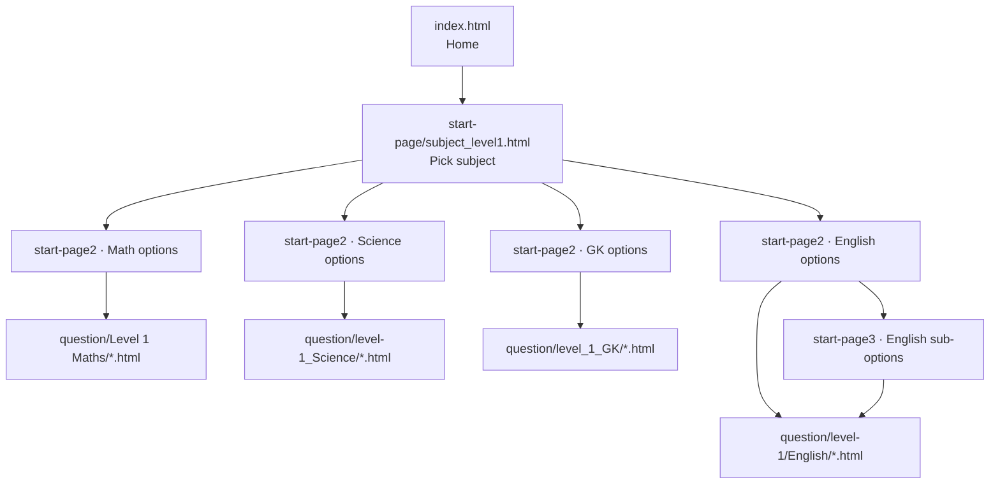

# Loyal's MCQ — Class 1 Quiz Website

A static, browser-based quiz application for **Class 1 (Grade 1)** learners. It offers
bite-sized, self-checking multiple-choice quizzes across **Math, English, Science, and
General Knowledge (GK)**, with a friendly, colourful, child-appropriate interface.

The app is built with **plain HTML, CSS, and vanilla JavaScript** — no build step, no
framework, no backend. Every page is a static file that can be opened through any web
server (or GitHub Pages).

---

## Table of contents

- [What this project is](#what-this-project-is)
- [Key features](#key-features)
- [Technology stack](#technology-stack)
- [Repository structure](#repository-structure)
- [How content is organized](#how-content-is-organized)
- [Quick start](#quick-start)
- [Documentation index](#documentation-index)
- [Conventions at a glance](#conventions-at-a-glance)

---

## What this project is

- **Audience:** Class 1 students (roughly ages 5–7), plus the teachers/parents who set
  them up.
- **Problem it solves:** gives young learners short, repeatable, self-marking practice
  quizzes that are visually simple and encouraging.
- **Shape of the product:** a tree of static pages. The learner picks a *level*, then a
  *subject*, then a *topic/exercise*. Each exercise presents one question at a time with
  tappable answer options, instant feedback, a short explanation, and a final score.

Each exercise file stores a **bank of 100 questions** but shows the learner a **random
25** per attempt, so repeated practice stays fresh.

---

## Key features

| Feature | Summary |
|---|---|
| Multiple subjects | Math, English, Science, General Knowledge |
| Three quiz formats | Multiple-choice (MCQ), drag-and-drop, listen-and-choose (audio) |
| 100-question banks | Every math & GK exercise holds 100 questions internally |
| 25-question attempts | A fresh random 25 is drawn from the 100 on every open |
| Instant feedback | Correct/incorrect highlighting, an explanation, and emoji "rain" |
| Shared header/footer | Injected by JavaScript so every page stays consistent |
| Fully responsive | Desktop, tablet, and mobile layouts with an off-canvas mobile menu |
| Zero dependencies | No framework or bundler; just static files |

---

## Technology stack

| Layer | Technology | Notes |
|---|---|---|
| Markup | HTML5 | One static file per page/exercise |
| Styling | CSS3 | Design tokens via CSS custom properties; 4 stylesheets |
| Behavior | Vanilla JavaScript (ES6) | No framework; global init functions on `window` |
| Fonts | Google Fonts | **Baloo 2** (display) + **Nunito** (body), via `@import` |
| Icons | Bootstrap Icons | Loaded from a CDN by `js/partials.js` (footer icons) |
| Hosting | Static hosting | Works on GitHub Pages (`.github/workflows/static.yml`) or any static server |

There is **no package.json, no Node runtime requirement, and no build pipeline** for the
site itself. (Two optional Python scripts exist only to *generate* question banks — see
[docs/question-banks.md](docs/question-banks.md).)

---

## Repository structure

```
NEW_LOYAL_QUIZ/
├── index.html                 # Home page (hero + level selection)
├── README.md                  # You are here
├── css/                       # All stylesheets
│   ├── index.css              # Home, section/options pages, header, footer
│   ├── question.css           # MCQ quiz pages (the quiz "shell")
│   ├── dnd.css                # Drag-and-drop quiz layer (loaded with question.css)
│   └── audio_style.css        # Audio "listen & choose" pages (loaded with index.css)
├── js/
│   ├── script.js              # MCQ quiz engine (initMCQQuiz) + emoji rain
│   ├── drag_and_drop.js       # Drag-and-drop engines (initDragDropQuiz / initTwoBoxSortQuiz)
│   ├── audio.js               # Listen-and-choose engine (Web Speech API)
│   └── partials.js            # Injects header/footer/favicons; computes site root
├── partials/                  # Reference copies of the header/footer markup (not loaded directly)
│   ├── header.html
│   └── footer.html
├── start-page/                # Level → subject selection pages
│   └── subject_level1.html    # Level 1: English / Math / Science / GK
├── start-page2/               # Subject → topic (exercise) selection pages
│   └── Level 1/
│       ├── Level1_math_options.html
│       ├── Level1_science_options.html
│       ├── Level1_gk_options.html
│       └── subject_level1_english_options.html
├── start-page3/               # Extra sub-grouping pages (English: identify / sight words)
├── question/                  # All exercise (quiz) pages
│   ├── Level 1 Maths/         # 47 math exercises (MCQ, 100 questions each)
│   ├── level_1_GK/            # 25 GK exercises (100 questions each)
│   ├── level-1/English/       # English exercises (MCQ, drag-and-drop, audio)
│   └── level-1_Science/       # 20 science exercises (MCQ)
├── pages/                     # Static content pages
│   ├── aboutus.html
│   └── contactus.html
├── image/                     # Logo, question images, custom font, etc.
├── favicon/                   # Favicon assets + web manifest
├── gen_questions.py           # (Tooling) generates the 100-question math banks
└── gen_gk.py                  # (Tooling) generates the GK banks + topic files
```

See [docs/architecture.md](docs/architecture.md) for a folder-by-folder breakdown.

---

## How content is organized



The learner always moves **home → subject → topic → exercise**. Exercise pages are the
leaves of the tree and contain the actual question data.

| Section | Folder | Count | Engine |
|---|---|---|---|
| Math | `question/Level 1 Maths/` | 47 files | MCQ (`initMCQQuiz`) |
| General Knowledge | `question/level_1_GK/` | 25 files | MCQ (`initMCQQuiz`) |
| Science | `question/level-1_Science/` | 20 files | MCQ (`initMCQQuiz`) |
| English | `question/level-1/English/` | ~49 files | MCQ + drag-and-drop + audio |

---

## Quick start

This is a static site, but it **must be served over HTTP** (not opened with `file://`)
so that the header/footer partials and shared assets resolve correctly.

```bash
# From the project root, start any static server. For example:
python -m http.server 8753
```

Then open <http://localhost:8753/index.html>.

> A ready-made preview config lives in `.claude/launch.json` (serves the folder on port
> 8753 via Python's `http.server`).

If pages render without a header/footer, or the logo/favicon is missing, you are almost
certainly opening files directly from disk instead of through a server — see
[docs/troubleshooting.md](docs/troubleshooting.md).

---

## Documentation index

| Document | What it covers |
|---|---|
| [docs/architecture.md](docs/architecture.md) | Folder responsibilities, partial injection, page flow, CSS/JS wiring |
| [docs/quiz-engine.md](docs/quiz-engine.md) | The three quiz engines, question data shape, feedback, the 25-of-100 logic |
| [docs/question-banks.md](docs/question-banks.md) | Math/GK file structure, generators, content guidelines |
| [docs/ui-and-styling.md](docs/ui-and-styling.md) | Design tokens, the four CSS files, components, responsiveness, assets |
| [docs/extending.md](docs/extending.md) | How to add exercises, questions, and option-page cards safely |
| [docs/troubleshooting.md](docs/troubleshooting.md) | Diagnosing path, partial, logo, favicon, rendering, and randomization issues |
| [docs/glossary.md](docs/glossary.md) | Project-specific terms |

---

## Conventions at a glance

- **Every page** includes `<div id="site-header-placeholder"></div>` and
  `<div id="site-footer-placeholder"></div>`, then loads `js/partials.js`, which replaces
  them with the real header/footer.
- **All paths** built by JavaScript are derived from `PARTIALS_ROOT` (the script's own
  URL), so they work at any folder depth and on GitHub Pages subdirectories.
- **MCQ exercises** define a global `const questions = [...]` and call
  `initMCQQuiz(questions)` on `DOMContentLoaded`.
- **The 100-question array is the source of truth.** The engine never mutates it; it
  shuffles a copy and shows the first 25.
- **Do not rename** the shared DOM ids/classes (`#question-text`, `#options-list`,
  `#feedback`, `#explanation`, `#next-btn`, `#back-btn`, `.quiz-container`, `.options`)
  without updating the JS that depends on them.
