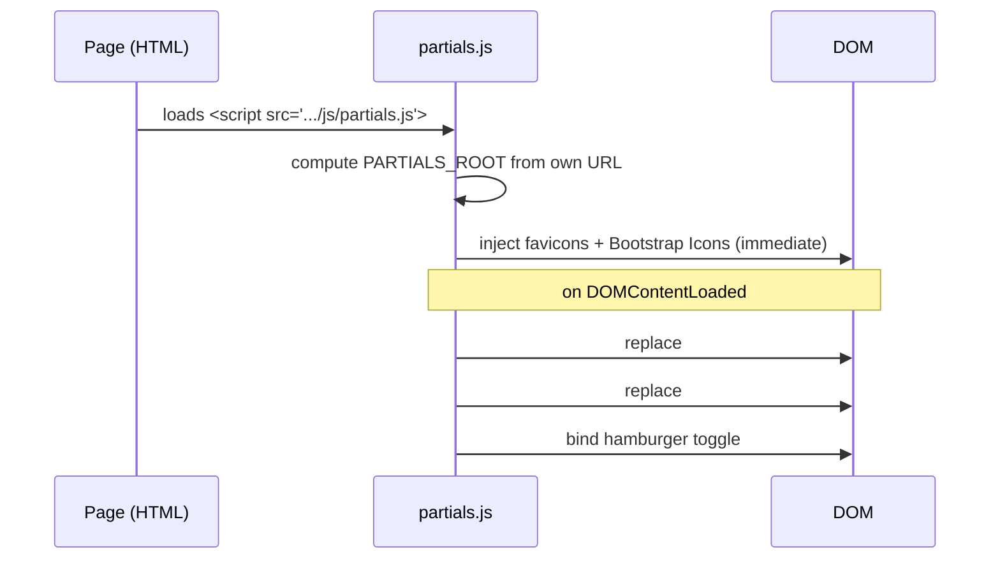
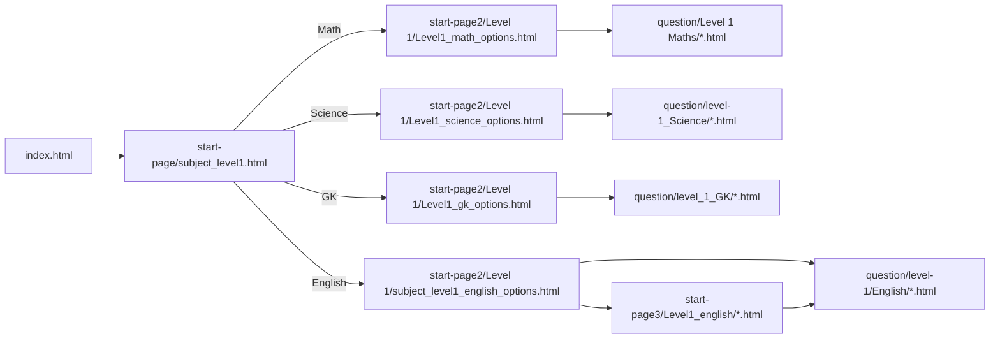

# Architecture

How the static site is assembled, how shared components are injected, and how HTML, CSS,
and JavaScript fit together.

- [Mental model](#mental-model)
- [Folder responsibilities](#folder-responsibilities)
- [The partial (header/footer) system](#the-partial-headerfooter-system)
- [Site-root resolution (`PARTIALS_ROOT`)](#site-root-resolution-partials_root)
- [Page anatomy](#page-anatomy)
- [Navigation and page flow](#navigation-and-page-flow)
- [How CSS is organized](#how-css-is-organized)
- [How JavaScript attaches to a page](#how-javascript-attaches-to-a-page)

---

## Mental model

The site is a **tree of independent static HTML pages**. There is no router and no shared
application shell rendered on the server. Instead, every page:

1. Links the CSS it needs in `<head>`.
2. Contains two empty placeholder `<div>`s for the header and footer.
3. Loads one or more JavaScript files at the end of `<body>`.
4. `js/partials.js` replaces the placeholders with the real header/footer and wires up
   favicons + the mobile menu.
5. Exercise pages additionally embed their question data and call a quiz engine.

This keeps each page self-contained while still sharing a single header, footer, and
visual system.

---

## Folder responsibilities

| Folder | Responsibility |
|---|---|
| `/` (root) | `index.html` (home) and project docs |
| `css/` | All styling. Four files, each scoped to a page type (see [UI & Styling](ui-and-styling.md)) |
| `js/` | All behavior: quiz engines + the partial/favicon injector |
| `partials/` | **Reference** markup for the header/footer. Not fetched at runtime — the live header/footer are generated as strings inside `js/partials.js` |
| `start-page/` | Level → subject selection (e.g., Level 1 → English/Math/Science/GK) |
| `start-page2/` | Subject → topic (exercise) selection grids ("options" pages) |
| `start-page3/` | Extra English sub-grouping (Identify Images, Sight Words) |
| `question/` | The actual exercise pages, grouped by subject |
| `pages/` | Standalone content pages (About, Contact) |
| `image/` | Logo, per-question images, and the local font file |
| `favicon/` | Favicon assets (`.ico`, `.svg`, PNGs) and `site.webmanifest` |

> **Note on `partials/`:** the files there are a readable copy of the markup. The header
> and footer that actually appear on pages are built by `js/partials.js`. If you change
> the header/footer, edit `js/partials.js` — editing `partials/*.html` alone has no effect.

---

## The partial (header/footer) system

Every page contains these two placeholders in `<body>`:

```html
<div id="site-header-placeholder"></div>
...
<div id="site-footer-placeholder"></div>
```

`js/partials.js` runs on `DOMContentLoaded` and:

1. Builds the header HTML (logo, brand text, hamburger button, nav links) as a string.
2. Replaces `#site-header-placeholder` via `outerHTML`.
3. Builds and injects the footer the same way.
4. Wires the mobile hamburger toggle (`#hamburger` ↔ `#nav-menu` `.active` class).

It also runs an immediate IIFE (`ensureIconStyles`) that injects, once per page:

- **Favicon links** (`<link rel="icon|shortcut icon|apple-touch-icon|manifest">`).
- The **Bootstrap Icons** stylesheet (for footer icons).
- A few small footer-icon helper styles.



Because the header/footer are injected, **a page only gets them if it loads
`js/partials.js`**. All real pages do.

---

## Site-root resolution (`PARTIALS_ROOT`)

The trickiest part of a multi-folder static site is building links/asset paths that work
from **any depth** (`/index.html`, `/question/Level 1 Maths/x.html`, etc.) and on
**GitHub Pages project subdirectories** (`/RepoName/...`).

`js/partials.js` solves this by deriving the site root from **its own script URL** rather
than guessing from `window.location`:

```js
const PARTIALS_ROOT = (function () {
  const self = document.currentScript || /* fallback: find the partials.js <script> */;
  return self && self.src
    ? self.src.replace(/js\/partials\.js.*$/, '')  // strip "js/partials.js"
    : '/';
})();
```

`partials.js` always lives at `<root>/js/partials.js`, so stripping that tail yields the
correct root. Every header/footer link, the logo image, and all favicon hrefs are built
as `PARTIALS_ROOT + "..."`.

> This is the mechanism behind the logo and favicon working on deeply nested pages. If you
> move `js/partials.js`, update this logic. See [Troubleshooting](troubleshooting.md).

---

## Page anatomy

A typical **exercise** page looks like this (simplified):

```html
<!DOCTYPE html>
<html lang="en">
  <head>
    <meta charset="UTF-8" />
    <meta name="viewport" content="width=device-width, initial-scale=1.0" />
    <title>...</title>
    <link rel="stylesheet" href="../../css/question.css" />
  </head>
  <body>
    <div id="site-header-placeholder"></div>

    <main class="quiz-container">
      <div class="question-section">
        <h3 id="question-text">Loading...</h3>
        <ul class="options" id="options-list"></ul>
      </div>
      <div id="feedback" class="hidden"></div>
      <div id="explanation" class="hidden"></div>
      <button id="back-btn" class="hidden">Back</button>
      <button id="next-btn" class="hidden">Next</button>
    </main>

    <script>
      const questions = [ /* 100 question objects */ ];
    </script>

    <div id="site-footer-placeholder"></div>

    <script src="../../js/script.js"></script>
    <script src="../../js/partials.js"></script>
    <script>
      window.addEventListener("DOMContentLoaded", () => initMCQQuiz(questions));
    </script>
  </body>
</html>
```

The **stable contract** every MCQ page honors:

| Element | Purpose |
|---|---|
| `#site-header-placeholder` / `#site-footer-placeholder` | Replaced by partials.js |
| `.quiz-container` | The card wrapper the engine looks inside |
| `#question-text` | Where the question text/HTML is written |
| `#options-list` (`ul.options`) | Where answer `<li>`s are rendered |
| `#feedback` / `#explanation` | Result message and solution text |
| `#back-btn` / `#next-btn` | Navigation, toggled by the engine |
| `const questions` + `initMCQQuiz(questions)` | The data + the engine call |

---

## Navigation and page flow



- **Home (`index.html`)** shows a hero and a "Level 1" card linking to the subject page.
- **Subject page (`subject_level1.html`)** shows a card grid for English, Math, Science,
  and GK, each linking to that subject's options page.
- **Options pages (`start-page2/...`)** show one card per exercise. Cards link directly to
  exercise files, except some English cards that route through `start-page3/` sub-menus
  (Identify Images, Sight Words).
- **Exercise pages (`question/...`)** are the leaves and run a quiz engine.

The header is constant across all of these (Home, About Us, Contact links).

---

## How CSS is organized

Each page links only the stylesheet(s) it needs. There is **no global concatenated CSS**.

| Page type | Stylesheets linked |
|---|---|
| Home / options / About / Contact | `css/index.css` |
| MCQ exercise (math, GK, science, most English) | `css/question.css` |
| Drag-and-drop exercise (English) | `css/question.css` + `css/dnd.css` |
| Audio exercise (English sight words) | `css/audio_style.css` + `css/index.css` |

All four stylesheets declare the **same `:root` design tokens** (colours, fonts, spacing,
radii, shadows), so components look identical regardless of which file is active. Details
in [UI & Styling](ui-and-styling.md).

---

## How JavaScript attaches to a page

JavaScript is plain ES6 with **global init functions** exposed on `window`. There are no
modules and no imports.

| File | Exposes | Used by |
|---|---|---|
| `js/script.js` | `window.initMCQQuiz(questions)`, `addEmojiRain()` | All MCQ exercises |
| `js/drag_and_drop.js` | `window.initDragDropQuiz`, `window.initTwoBoxSortQuiz` | English drag-and-drop |
| `js/audio.js` | Self-initializing audio quiz (reads `questions` + DOM ids) | English sight-words |
| `js/partials.js` | (none public) header/footer/favicon injection | Every page |

An exercise page loads the engine file, then `partials.js`, then calls the engine inside
a `DOMContentLoaded` listener. The engine reads the page's `questions` array and the
fixed DOM ids, and takes over from there. See [Quiz Engine](quiz-engine.md).
