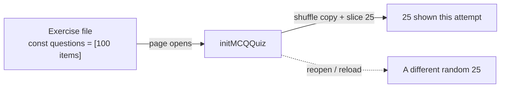

# Question Bank System

How math and GK question banks are structured, generated, and consumed — and the content
rules that keep them correct and age-appropriate.

- [The 100/25 model](#the-10025-model)
- [Math files](#math-files)
- [GK files](#gk-files)
- [The generators](#the-generators)
- [Regenerating banks](#regenerating-banks)
- [Content guidelines](#content-guidelines)

---

## The 100/25 model

- **Each math and GK exercise stores exactly 100 questions** in its `const questions`
  array. This array is the **source of truth**.
- At runtime, the MCQ engine shows a **random 25** of those 100 (see
  [Quiz Engine → 25-of-100](quiz-engine.md#the-25-of-100-randomization)).
- The 100-question file is what you edit/regenerate; the 25 is purely a runtime view.



---

## Math files

- **Location:** `question/Level 1 Maths/` (47 files).
- **Engine:** MCQ (`initMCQQuiz`).
- **One topic per file**, encoded in the filename, e.g.:

| Filename pattern | Topic |
|---|---|
| `level_1_addition_upto_N.html` | Addition with sums up to N |
| `level_1_subtraction_till_N.html` | Subtraction within N |
| `level_1_adding_doubles_till_N.html` | Doubles (a + a) |
| `level_1_convert_numbers_till_N.html` | Numeral → words |
| `level_1_reading_numbers_till_N.html` | Words → numeral |
| `level_1_number_line_upto_N.html` | Number line (uses a shared image) |
| `level_1_odd_even_till_N.html` | Odd / even |
| `level_1_place_value.html` | Tens / ones |
| `Level_1_maths_Compare_Numbers.html` | `>`, `<`, `=` |
| `Level_1_maths_Number_Bonds_to_10.html` | Number bonds to 10 |
| `level_1_word_problems_till_N.html` | Story sums |
| ... | (counting, shapes, before/after, ascending/descending, missing number) |

Each item is a standard MCQ object (`question`, `options`, `correct`, `explanation`, and
optionally `image`). The math content is **procedurally generated** so it is
mathematically correct by construction. Some narrow topics use light phrasing variety and
gentle numeric progression to reach a full, non-duplicate 100.

---

## GK files

- **Location:** `question/level_1_GK/` (25 files).
- **Engine:** MCQ (`initMCQQuiz`).
- Two distinct kinds:

| Files | Kind | Card label on the GK options page |
|---|---|---|
| `level1_gk_l1.html` … `level1_gk_l20.html` | **Mixed** general knowledge — each is a 100-item blend across many categories | Friendly *mixed-GK* names (e.g., "Brain Boost", "Star Quiz", "Wise Owl") |
| `level1_gk_animals.html`, `level1_gk_fruits_veg.html`, `level1_gk_colours.html`, `level1_gk_my_body.html`, `level1_gk_days_months.html` | **Single-topic** — 100 items all on one subject | Topic names (Animals, Fruits & Vegetables, Colours, My Body, Days & Months) |

> **Why the mixed files are not labelled as single topics:** files 1–20 contain a *blend*
> of categories (a single file mixes animals, colours, days, etc.). Their option cards use
> engaging "mix of GK" identities rather than single-topic titles, so the card never
> contradicts the file's actual questions. Files 21–25 are genuinely single-topic and are
> labelled accordingly.

The mixed banks are assembled from a vetted pool of ~700 distinct Class-1 GK questions; the
topic banks are generated from that topic's category. Each file ends up with 100 unique,
correct, child-appropriate questions.

---

## The generators

Two **optional** Python scripts at the repo root produce the banks. They are *tooling*,
not part of the running site — the site only needs the generated HTML.

| Script | Produces |
|---|---|
| `gen_questions.py` | The 100-question banks for all 47 `question/Level 1 Maths/*.html` files |
| `gen_gk.py` | The mixed 100-question banks for `level1_gk_l1..l20.html` **and** creates/fills the 5 single-topic GK files |

How they work (both follow the same safe pattern):

1. Build 100 topic-aligned question objects in Python.
2. Locate the page's `const questions = [ ... ]` array via **bracket-matching** (so
   nested `[` `]` inside options don't confuse it).
3. Replace **only** that array; the surrounding HTML, scripts, and `initMCQQuiz(...)` call
   are untouched.
4. Assert each file has exactly 100 items, `correct ∈ options`, options are distinct, and
   question texts are unique.

This makes regeneration **idempotent** and non-destructive to page structure.

---

## Regenerating banks

> Requires Python 3. These overwrite the question arrays in place — commit/back up first
> if you have hand-edited any bank.

```bash
# From the project root
python gen_questions.py   # rewrites all math banks
python gen_gk.py          # rewrites GK mixed banks + (re)creates the 5 topic files
```

Each script prints a per-file `-> 100` confirmation and validates integrity. If you only
want to hand-edit questions, you can skip the generators entirely and edit the
`const questions` array in the HTML directly — just keep it valid (see guidelines below).

---

## Content guidelines

When writing or generating questions for **Class 1** learners:

**Correctness & structure**
- `correct` must be **exactly** one of the `options` (string-identical).
- Use 2–4 options. Keep distractors clearly wrong but plausible (near values, same
  category) — never a second defensible answer.
- No duplicate or near-duplicate question texts within a file.
- Keep the bank at **100** for math/GK to preserve the 25-of-100 behavior.

**Tone & difficulty**
- Simple, friendly wording. Short sentences. Familiar objects and names.
- Keep numbers/topics at a Grade-1 level; only progress gently if a topic needs more
  range to reach 100 distinct items.
- For GK, prefer indisputable facts (a cow says "moo", grass is green). Avoid ambiguous or
  regional answers.

**Formatting**
- Inline HTML is allowed in `question`/`explanation` (`<br>`, `<strong>`,
  `<span style="...">`). Use single quotes for inline attribute values so they sit safely
  inside the double-quoted JS string.
- Keep explanations to one short, encouraging line.

See [Extending the project](extending.md) for step-by-step instructions on adding files
and questions.
