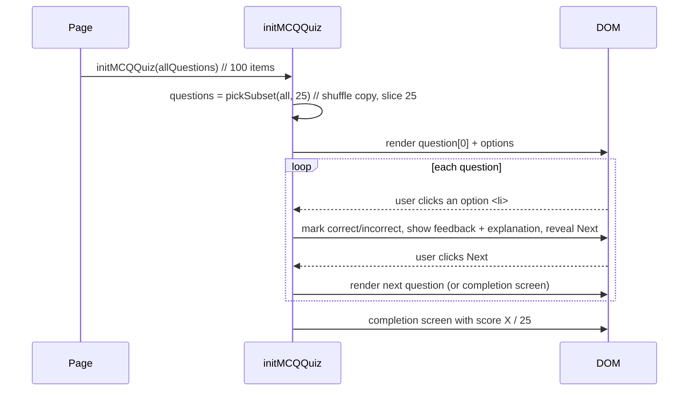

# Quiz Engine & Exercise Logic

There are **four** quiz engines, each in its own JavaScript file. The MCQ engine powers
the large majority of exercises (all Level-1 Math, GK, Science, and most English); the
tap-to-select engine powers the KG-3 math section.

- [The MCQ engine (`initMCQQuiz`)](#the-mcq-engine-initmcqquiz)
- [Question data shape](#question-data-shape)
- [The 25-of-100 randomization](#the-25-of-100-randomization)
- [Rendering, answering, and feedback](#rendering-answering-and-feedback)
- [Navigation and completion](#navigation-and-completion)
- [Emoji rain](#emoji-rain)
- [The drag-and-drop engines](#the-drag-and-drop-engines)
- [The audio engine](#the-audio-engine)
- [The tap-to-select engine](#the-tap-to-select-engine)

---

## The MCQ engine (`initMCQQuiz`)

Defined in `js/script.js` and exposed as `window.initMCQQuiz`. A page calls it once:

```js
window.addEventListener("DOMContentLoaded", () => initMCQQuiz(questions));
```

It is a closure that holds all per-attempt state (current index, score, the chosen 25)
and reads these fixed DOM hooks:

| DOM hook | Role |
|---|---|
| `.question-section` | Container the engine inserts the optional image into |
| `#question-text` | Question text/HTML target |
| `#options-list` (`ul.options`) | Answer list; engine appends `<li>` per option |
| `#feedback` | "Well done" / "Oops, try again" message |
| `#explanation` | Optional solution text |
| `#next-btn`, `#back-btn` | Navigation buttons (shown/hidden via `.hidden`) |



---

## Question data shape

Each exercise embeds a plain array named `questions`. Every item is an object:

```js
{
  question: "What is 2 + 3?",      // string; may contain safe inline HTML
  options:  ["4", "5"],            // 2–4 strings; one must equal `correct`
  correct:  "5",                   // must be exactly one of `options`
  explanation: "2 + 3 = 5",        // optional; shown after answering
  image: "../../image/level_1_math/number_line_1_to_50.jpg" // optional
}
```

Rules the engine relies on:

- `correct` **must be string-identical** to one of the `options` (the engine compares and
  also matches by the option's text to reveal the right answer on a wrong guess).
- `options` may be 2, 3, or 4 entries. Labels `A`–`D` are added automatically.
- `question` and `explanation` are inserted with `innerHTML`, so simple tags like
  `<br>`, `<strong>`, and `<span style="...">` are supported (used for emphasis,
  underlines in place-value questions, emoji groups, etc.).
- `image`, when present, is shown above the question; when absent, the image element is
  hidden.

> Math and GK files store **100** such objects. See
> [Question Banks](question-banks.md).

---

## The 25-of-100 randomization

The full `questions` array is the **source of truth and is never mutated**. On each call,
the engine draws a fresh random subset:

```js
const QUIZ_SIZE = 25;

function shuffle(arr) {              // Fisher–Yates on a COPY
  const a = arr.slice();
  for (let i = a.length - 1; i > 0; i--) {
    const j = Math.floor(Math.random() * (i + 1));
    [a[i], a[j]] = [a[j], a[i]];
  }
  return a;
}

function pickSubset(bank, size) {
  const list = Array.isArray(bank) ? bank : [];
  return shuffle(list).slice(0, Math.min(size, list.length));
}

// inside initMCQQuiz:
const questions = pickSubset(allQuestions, QUIZ_SIZE);
```

Behavioral consequences:

- **A new random 25 is selected every time the page opens or reloads.** Randomization
  happens at init time (`DOMContentLoaded`), so reopening an exercise reshuffles.
- **Order is randomized too** (the whole copy is shuffled before slicing).
- **Graceful for small banks:** if a file has fewer than 25 questions (e.g., some English
  MCQ files), it shows all of them, shuffled (`Math.min(size, list.length)`).
- The **completion score** is reported out of the subset size (e.g., `/ 25`).

---

## Rendering, answering, and feedback

**Rendering a question** (`loadQuestion`):

- Shows/hides the optional image.
- Writes `#question-text`.
- Builds one `<li class="mcq-option">` per option, each containing a label (`A.`), the
  option text, and an empty icon slot.
- Hides feedback/explanation/Next; shows Back only when not on the first question.

**Answering** (`checkAnswer`, fired by clicking an option):

- Disables further clicks on that question.
- If correct: marks the option `.correct`, sets a ✔ icon, message "Well done ❤️", and
  triggers heart emoji rain.
- If wrong: marks the option `.incorrect` with a ✖, then also reveals the real answer by
  finding the option whose text equals `correct` and marking it `.correct`. Message is
  "Oops, try again 😢" with a sad emoji rain.
- Shows `#feedback`, and `#explanation` if the question has one.
- Reveals the Next button.

The CSS classes `.correct` / `.incorrect` provide the colour states (green/red) defined in
`css/question.css`.

---

## Navigation and completion

- **Next** advances the index; if past the last of the 25, it renders the completion
  screen. **Back** returns to the previous question.
- **Completion screen** replaces the question area with a "🎉 Quiz Completed!" message,
  the score (`correctCount / total`, where total is the 25-question subset length), and a
  **Home** button.
- The Home button resolves its destination from the header logo link (or a nav link to
  `index.html`), so it respects the site root.

The buttons use the `.hidden` utility (`display: none !important`) so the engine's
show/hide always wins over the buttons' own `display` rules.

---

## Emoji rain

`addEmojiRain(emoji, count)` (in `js/script.js`) appends a fixed-position
`#emoji-rain` overlay and drops animated emoji that clean themselves up on
`animationend`. It is purely decorative feedback and has no effect on scoring.

---

## The drag-and-drop engines

Defined in `js/drag_and_drop.js`, used by a handful of English exercises. Two variants:

| Engine | Interaction | Key DOM |
|---|---|---|
| `initDragDropQuiz(questions)` | Drag a chip into a single inline blank | `#choices`, an inline `.dropzone`, `#feedback`, `#next-btn`, `#back-btn` |
| `initTwoBoxSortQuiz(questions)` | Drag word chips into 2–4 labelled boxes (sentence ordering / sorting) | `.two-targets > .dropbox`, `#choices`, nav buttons |

Drop-zone state classes (styled in `css/dnd.css`): `.over` (drag hovering), `.correct`,
`.incorrect` / `.wrong`, and `.has-value` (filled). These engines have their **own** small
question sets and are **not** part of the 25-of-100 MCQ flow.

> The drag-and-drop pages load `css/question.css` **and** `css/dnd.css` — the latter is a
> thin layer that adds the draggable/drop-zone styling on top of the quiz shell.

---

## The audio engine

`js/audio.js` powers the "Listen and choose the correct word" sight-word exercises (3
files). It uses the browser **Web Speech API** (`speechSynthesis`) to read a word aloud,
then the learner picks the matching written word.

Relevant DOM ids: `#playBtn`, `#options`, `#feedback`, `#instruction`, `#qimg`,
`#prevBtn`, `#nextBtn`, `#index`, `#total`. Answer buttons get `.correct` / `.wrong`
classes; the Next button gets `.is-disabled` until an answer is chosen. Styling lives in
`css/audio_style.css`. Like the drag-and-drop engines, audio exercises have their own
fixed question lists and are independent of the MCQ 25-of-100 logic.

---

## The tap-to-select engine

Defined in `js/tap_select.js` and exposed as `window.initTapSelectQuiz`. It powers the
**KG-3 math** section and is deliberately **subject-agnostic** (reusable for
English/Science/GK). The learner taps the correct picture(s), or taps a given *number* of
things. Like the MCQ and audio engines, it **follows the 100-in-bank / 25-shown
contract** — the full `questions` array is never mutated; a fresh random 25 is drawn on
open.

A page calls it once, links `css/question.css` **and** `css/tap_select.css`, and provides
a `<div id="tap-grid">` for the tiles (plus the usual shared hooks). The engine creates
the live tap-counter and the **Check** button itself:

```js
window.addEventListener("DOMContentLoaded", () => initTapSelectQuiz(questions));
```

It reuses `#question-text`, `#feedback`, `#explanation`, `#next-btn`, `.quiz-container`
and adds `#tap-grid`. Two question shapes:

**Match mode** — tap the item(s) that fit a rule:

```js
{
  question: "Tap the 🔺 triangle",
  items: [
    { label: "🔺", correct: true },
    { label: "🟦", correct: false },
    { label: "⚫", correct: false }
  ],
  explanation: "A triangle has 3 sides."   // optional
}
```

- `items` may also be plain strings (treated as `correct:false` distractors).
- **1 correct** item → a single tap checks instantly (MCQ-like).
- **>1 correct** items → tap several, then press the **Check** button (multi-select).

**Count mode** — tap a given *number* of things:

```js
{ question: "Tap 4 apples 🍎", count: 4, items: ["🍎","🍎","🍎","🍎","🍎","🍎"],
  explanation: "Count 1, 2, 3, 4 as you tap." }
```

- Any `count` tiles are accepted; a live "Tapped: N" counter helps young learners.

**Optional per-question fields:**

| Field | Effect |
|---|---|
| `image` | Shows a scene image above the question (hidden gracefully if missing — used for image TODOs). |
| `layout` | `"row"` or `"column"` fixes the tile arrangement for spatial concepts (left/right, above/below). Default is the responsive grid. |

Feedback matches the MCQ engine ("Well done ❤️" / "Oops, try again 😢" with emoji rain);
result tiles get `.correct` / `.incorrect`, and unpicked correct answers are revealed with
`.missed`. Styling lives in `css/tap_select.css` (a thin layer over the quiz shell that
uses the shared design tokens only).
